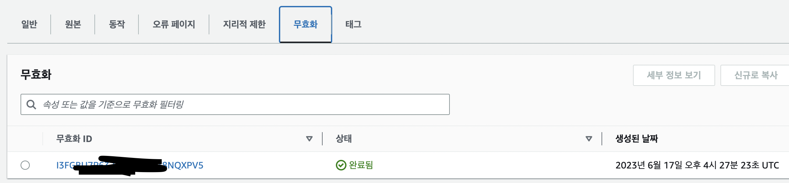

## 요약

1. 포트폴리오 사이트 업데이트 후, 사이트 다운 😭
2. Vue 빌드 문제인지 알고 다시 빌드 후, 업데이트했지만 같은 현상 발생 😭
3. 개발자 도구로 원인 발견 - css, js 예전 파일을 요청하고 있었음 😮
4. S3 정적 웹사이트 설정 확인 - 정상 작동 중 🧐
5. CloudFront 설정 확인 - 똑같은 다운 현상 발생으로 원인 발견!! 🤩
6. 진정한 원인 체크: CloudFront CDN 때문에 원본 데이터 업데이트가 느렸다. ✅
7. CloudFront 캐싱 무효화로 문제 해결 👍

<!--truncate-->

 

## 문제 상황

오랜만에 포트폴리오 내용을 업데이트하려고 포트폴리오 사이트에 들어갔다. 마음에 안 드는 부분이 있어 살짝 고치고 필요없는 부분을 제거했고 S3에 빌드파일을 업데이트했다. 그 후 사이트를 들어가봤는데 ...? 사이트가 정상작동하지 않았다.

 

## 원인 발견

### 빌드 실패일까?

이전에 파일이 15개 올라가서 이번에 잘못 빌드된 건가 싶어 다시 빌드해서 올려보았지만, 그래도 정상작동하지 않았다. 생각해보니 필요없는 부분을 제거하며서 이미지가 몇 개 날라갔기 때문에 파일의 숫자가 작아진 것이었고 빌드파일은 정상이었다.

흠.. 그렇다면 무슨 문제일까? 개발자도구를 켜서 확인해보니 css 파일과 js 파일이 불러오지 않는다는 것을 확인했고, 해당 css, js 파일을 확인해보니 파일이름이 다른 것을 불러오고 있었다. DNS TTL도 짧게 설정했는데 왜 이렇게 파일이 예전 파일을 가져오는 것일까?

### 예전 파일을 가져오는 이유는?

처음엔 S3의 정적웹사이트 설정이 잘못되었는지 확인해야 했다. 포트폴리오 주소는 따로 도메인을 사서 해당 도메인은 리다이렉팅되어 도착하는 주소이고, 원래 주소는 S3에서 따로 제공하기 때문에 해당 주소로 들어가 보았다. 그런데 S3에서 제공하는 링크는 잘 작동했고 다른 원인을 찾아야 했다.

생각해보니 예전에 https를 설정하기 위해 Certificate Manager와 Cloud Front 설정을 같이 해놨다는 것이 떠올랐고, Cloud Front에 들어가서 다이렉트 링크를 확인해보니 똑같이 에러가 떴다. **CloudFront가 문제**였다.

### 진정한 원인 발견

CloudFront가 문제더라도 진정한 원인을 찾아야 했다. CloudFront는 CDN을 사용하니까 데이터가 업데이트 안되는 현상이 발생할거라는 가정을 했고, 그 생각은 맞았다. 진정한 원인은 **CloudFront의 CDN에 원본 데이터가 업데이트되는 시간이 느려서 발생**했던 것이었다.

 

## 문제 해결

해당 원본 데이터를 업데이트하기 위해서는 사실 시간만 기다려도 해결될 문제지만, 그 시간을 기다리는 것은 진정한 해결방법이 아니라고 생각했다. 찾아보니 **캐싱 무효화**를 통해 해당 문제를 해결할 수 있다는 것을 알게 되었고 루트 캐싱 무효화를 선언하고 실행했다. 캐싱 무효화 후, 사이트를 확인해보니 원본 데이터가 업데이트되었고 정상작동하게 되었다.

 
