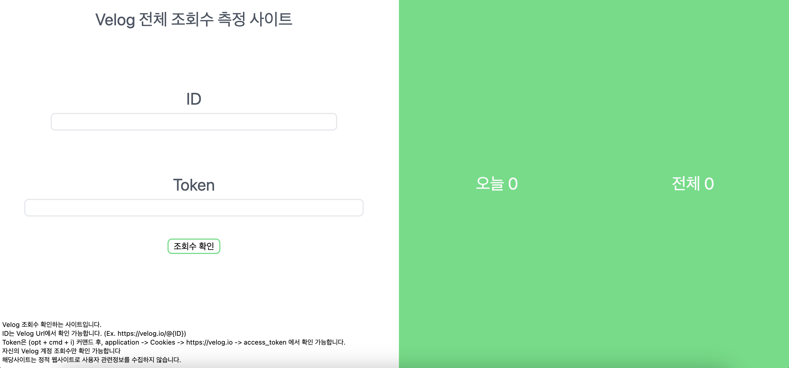

## 문제 상황

벨로그에는 통계를 보는 탭이 있지만 각 글에 대해서만 통계를 볼 수 있고, 전체 통계는 보지 못 한다. 그렇기 때문에 내 벨로그 전체를 보려면 하나씩 확인해야 하는데, 여간 귀찮은 일이 아닐 수 없다. 그렇기 때문에 **'벨로그 전체 통계 사이트를 한 번 만들어 보면 어떨까?'** 라는 생각을 했고 사이트를 만들기 시작했다.

<!--truncate-->

<br/>

## 기존 통계사이트 탐색

벨로그 통계에 대한 부분은 다른 사람들도 공감을 했는지 많은 사람들이 만들었던 기록이 있었다. 하지만 사이트로 완전히 배포된 게 없었다. 그냥 코드로만 남아있을 뿐이다. 앞단을 다들 만들기 귀찮았겠거니 라고 생각하고 개발에 착수했다. ~~(다 만들고 나서야 왜 안 만들었는지 알게 되었지만 말이다...)~~

<br/>

## 통계 로직 만들기

전체 통계는 각 글의 통계에 들어 가서 개발자도구로 api 요청 어떻게 하는지 알아본 다음, 똑같이 graphql로 api 요청을 하면 되고, 이를 게시글 수만큼 돌리면 완성이라 쉬운 작업이었다. 밑은 예제 코드이다. 입력해야할 부분에 데이터만 넣으면 node.js 로 로컬에서 바로 실행 가능하다.

**조회수 가져오기**

```ts
import axios from "axios";

// -------- 입력해야 할 부분 -----------
const username = "ID"
const accessToken = "JWT"
// ---------------------------------

const url = "https://v2cdn.velog.io/graphql";

async function getStats(postId, accessToken) {
  const response = await axios.post(
    url,
    {
      operationName: "GetStats",
      query:
        "query GetStats($post_id: ID!) {\n  getStats(post_id: $post_id) {\n    total\n    count_by_day {\n      count\n      day\n      __typename\n    }\n    __typename\n  }\n}\n",
      variables: {
        post_id: postId,
      },
    },
    {
      headers: {
        cookie: `access_token=${accessToken};`,
      },
    }
  );
  return response.data.data.getStats;
}

async function getPosts(
  previousPostId,
  username,
  accessToken
) {
  const response = await axios.post(url, {
    operationName: "Posts",
    withCredentials: true,
    query:
      "query Posts($cursor: ID, $username: String, $tag: String) {\n  posts(cursor: $cursor, username: $username, tag: $tag) {\n    id\n    title\n    short_description\n    thumbnail\n    user {\n      id\n      username\n      profile {\n        id\n        thumbnail\n        __typename\n      }\n      __typename\n    }\n    url_slug\n    released_at\n    updated_at\n    comments_count\n    tags\n    is_private\n    likes\n    __typename\n  }\n}\n",
    variables: {
      tag: null,
      username: username,
      cursor: previousPostId,
    },
    headers: {
      cookie: `access_token=${accessToken};`,
    },
  });

  return response.data.data.posts;
}

const postIds = [];
let posts = await getPosts(null, username, accessToken);
posts.forEach((x) => {
  postIds.push(x.id);
});
while (posts.length) {
  posts = await getPosts(posts.pop().id, username, accessToken);
  posts.forEach((x) => {
    postIds.push(x.id);
  });
}

let total = 0;
let today = 0;
const date = new Date();
for (const x of postIds) {
  const stat = await getStats(x, accessToken);
  if (stat !== null) {
    total += stat.total;
    if (stat.count_by_day.length) {
      if (
        stat.count_by_day[0].day.slice(0, 10) ===
        date.toISOString().slice(0, 10)
      ) {
        today += stat.count_by_day[0].count;
      }
    }
  }
}

console.log(total, today);
```

<br/>

:::note
* ID는 Velog Url에서 확인 가능 (Ex. https://velog.io/@{ID})
* Token은 (opt + cmd + i) 커맨드 후, application -> Cookies -> https://velog.io -> access_token 에서 확인 가능
* 자신의 Velog 계정 조회수만 확인 가능
:::


<br/>

## 프론트 만들기

단순한 기능이라 사람들이 쉽게 사용할 수 있게만 만들면 된다고 생각했다. 그렇기 때문에 밑과 같이 벨로그 색깔로 만들었고, 주의사항을 바로 볼 수 있게 다 써놨다.



<br/>

## 테스트 실패

그러고 나서 테스트를 진행했다. 분명히 node로만 돌리면 나오던 전체 조회수가 프론트에 넣어서 브라우저로 돌리면 데이터가 나오지 않았다. Cookie를 넣고 요청을 하면 내가 넣은 Cookie가 자꾸 사라져 있는 것이다. 사실 코드가 틀린줄로만 알아서 계속 코드만 탓하고 있었다.

그러다가 프론트 개발자는 Cookie 설정 방법이 다른가 싶어, 프론트 개발자 친구에게 도움을 요청했다. 하지만 Cookie 넣는 방식은 현재 코드가 맞다고 했다.

<br/>

## 실패 원인 발견

다시 Cookie가 안 넣어지는 이유를 찾기 시작했고 검색을 통해 여러 정보를 수집한 결과, 브라우저 때문이라는 사실을 알게 되었다. 최신 브라우저들은 다른 사이트에서 Cookie를 변경 후 요청하는 작업을 제한할 수 있었고, 이는 크롬에 설정되어 있었다. 그렇게 Cookie를 멋대로 변경해서 보낼려면 Server가 필요했다.

<br/>

## 결국은 배포하지 않았다.

S3 정적 사이트로 올려서 비용문제를 해결하고 싶었지만, 어쩔 수 없이 서버를 이용해서 배포해야 했다. 하지만 **윤리문제**에 봉착했다. 서버를 이용한다면 accessToken이라는 개인정보를 이용해서 조회수를 불러오는 과정에 로깅을 할 수 있게 된다. 다시 말해, 악의적인 마음을 가지고 사용자들의 accessToken을 로깅해놓는다면 내가 조회수 통계 사이트 이용한 사람들의 글을 마음대로 삭제하고 수정할 수 있다는 것이다. 

물론 배포를 한다해도 수집하지 않을 것이긴 하지만 그래도 사용자들은 이걸 믿을 수 있을지에 대한 생각이 커져갔고, 그제야 다른 사람들이 코드만 올리고 이런 통계사이트를 안 만든 이유를 알게 되었다. 뭐.. 아쉽긴 하지만 나도 배포하진 않을 예정이고, 한 번씩 벨로그 전체 조회수가 궁금할 때는 로컬에서 코드 실행으로 확인해야겠다.

<br/>
