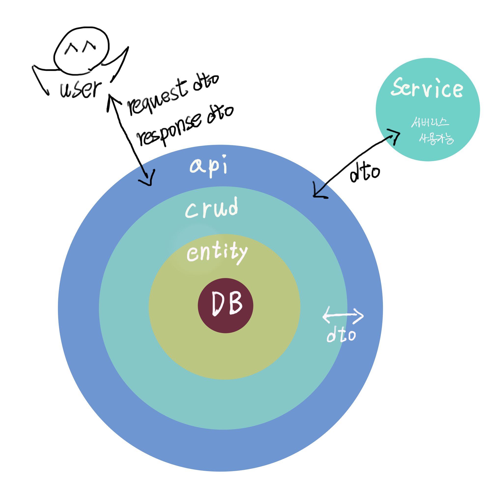

## 발단

여러 아키텍처을 접하다 보면서 두 가지 생각을 하게 되었다.

첫 번째는 Controller — Service — Repository 구조에서 아예 무거운 Service 로직이 있는 경우도 있고, 단순 조회, 저장같은 부분을 Repository 단과 연결시키는 경우도 있다. 하지만 단순 조회, 저장같은 경우, Repository만 써도 되고 무거운 Service인 경우, 아예 다른 Service를 만들어 사용한다. 그런데도 요즘 아키텍처들은 API 요청을 받는 단계와 CRUD를 실행하는 부분은 UseCase, Service 등으로 떨어져 있다는 것이다. 중간 로직 관리부분을 무조건 거쳐야할까? 관리하기는 그게 쉽다고 하는데, 그게 과연 관리하기 쉬운걸까?

<!--truncate-->

두 번째는 여러 아키텍처에서 서버리스를 어떻게 접목해야할지이다. MSA로 각 도메인을 나눠 여러 서버로 나눈다고 해도 각 도메인에 대한 서비스는 각 도메인에 종속되어 있을텐데 말이다. 서버리스에 대한 활용 예는 많긴 하지만, 현재 나와있는 아키텍처로는 서버리스를 제대로 활용하기 쉽지 않다.

그래서 고민을 하다가 **'서비스 단을 따로 떼어내면 어떨까?'**라는 생각이 들었다. 그렇게 플래닛 아키텍처를 고안하게 되었다.

 

## 설계 구상도

구상도는 아래와 같다. 구상도가 이렇게 나왔기 때문에 서버는 행성, 서비스는 위성 같다는 생각을 했고, 플래닛 아키텍처라고 명명하게 되었다.

 

## 기초 개념

각 서버 구성은 기본적으로 아래와 같이 비유할 수 있다.

* DB - 가공되지 않은 자원
* Entity - 가공된 자원
* Crud - 가공된 자원을 활용
* Dto - 가공된 자원에 대한 틀이나 새롭게 만든 구성품
* Service - 가공된 자원에 대한 틀이나 구성품을 요구에 맞게 활용하여 새로운 구성품 생성
* Api - 만들어진 구성품을 통해 요구에 따라 상품을 만들어 공급

 

## 설명

### 행성 - 서비스 외 서버, DB

행성에는 서비스 외 내용이 모두 들어간다. 먼저 Api는 행성 전체를 감싸고 있고, 그 안에는 Crud 단을 통해 Entity를 Dto로 변환하여 가져온다. Api에 통신할 때는 무조건 Dto를 통해서만 통신할 수 있게 하여 각 계층구조를 확실하게 지킨다. DB와 Entity는 하나의 DB에 종속된 라이브러리를 쓰지 않고 여러 DB를 같은 방식으로 사용할 수 있게 추상화한 ORM 라이브러리를 사용한다.

### 위성 - 서비스 및 서버리스

위성에는 서비스와 서버리스가 존재한다. 서비스의 간단한 로직같은 경우는 서버자체에서 돌리지만 무거운 작업은 각 서버에서 돌리는게 아니라 서버리스로 분리시킨다.

사실 서비스 전체를 서버리스로 돌리면 어떨까라는 생각을 했지만, 이는 간단한 작업을 서버리스로 분리해서 통신한다는 작업 자체가 부담이 된다고 생각했기 때문에 무거운 로직만 따로 분리하기로 했다.

### 더 나아가기

#### 멀티버스

멀티버스는 스케일링을 뜻한다. 행성을 복제한다는 뜻에서 멀티버스라는 명명을 붙였다. 그렇다고 서버리스인 위성을 복제한다는 개념까진 아니다. 서버리스는 알아서 스케일링이 가능하니 분리해서 생각한다.

#### 유니버스

유니버스는 MSA구조를 뜻한다. 각 도메인이 하나의 행성이 되고 세부 서비스별로 새로운 행성을 만들어서 사용해보면 좋을 듯 하다. 각 행성의 통신은 api 단에서 api 단으로 통신한다. 

 

## 끝으로

아직 주니어 백엔드 개발자라 여러 상황을 고려 못 했을 수도 있다. 그래서 이 플래닛 아키텍처에 대한 깊은 문제는 아직 끌어내지 못 했다. 그래도 실제로 한 번 사용해보면 단점을 알 수 있을듯 해서 사이드 프로젝트인 MyOKR에 사용해 보았고 한 가지 제약사항(서버리스로 데이터를 주고 받을 때, 데이터 크기가 크면 네트워크 비용(시간+돈)이 크게 발생)을 발견했다. 아직까지 해당 제약사항 말고는 찾지 못 했으며, 사이드 프로젝트라 서버를 크게 구성할 수 없어, MSA 구조나 스케일링 과정에서 문제가 있을지는 차차 알아봐야 할 듯하다.

 

:::info
플래닛 아키텍처를 적용한 사이드 프로젝트 - [MyOKR](https://github.com/sundayTen/pokr-server)
:::

 
