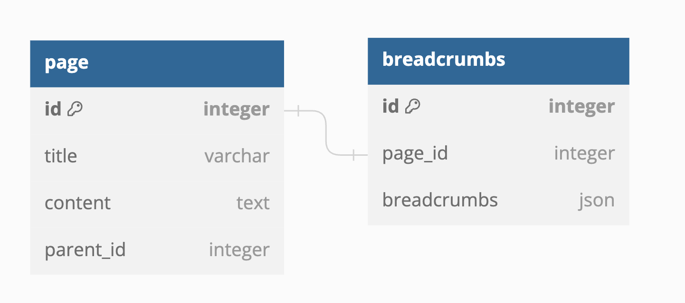

# BFS와 DP를 이용한 브레드크럼스 구현

## 🎯 문제: 브레드크럼스 구현

이번에 우연한 기회로 브레드크럼스를 구현하게 되었다. 사실 브레드크럼스라는 단어 자체를 처음 들어서 무슨 말인지 조차 몰랐는데, 이미 알게 모르게 엄청 많이 사용하고 있었던 기능이었다. 브레드크럼스는 헨젤과 그레텔의 빵부스러기를 본 따 만들어진 페이지 뎁스 기록을 말하는 거였고, 이걸 어떻게 구현해야할지 고민하기 시작했다.

<!--truncate-->

<br/>

## 📌 해결 과정 요약

1. 브레드크럼스가 무엇인지 확인
2. 모든 부모 페이지를 탐색하는 방안을 찾음
   - 조회 시, 부하가 너무 크다는 단점이 있음
3. 데이터를 캐싱함
   - 로직적으로 해결하고 싶은 욕구가 생김
4. DP를 이용하여 브레드크럼스 데이터를 쉽게 추가, 조회할 수 있게 만듬
   - 페이지 이동 시, 하위 페이지에 대한 브레드크럼스 갱신이 불가능
5. BFS를 이용하여 페이지 이동 시에만 하위 페이지 브레드크럼스 갱신
   - 페이지 생성은 자주 있을지라도, 페이지 이동 자체는 많이 있지 않을 행동이라 로직적으로 해결된 효율적인 코드 완성

<br/>

## 🔎 해결방안 도출

### 🕵️‍♂️ IDEA 1: 모든 부모 페이지 탐색

구현하는 내용은 노션 페이지 API에 나오는 브레드크럼스를 구현하면 되는 내용인데 뎁스의 제한이 없다는게 주요 포인트였다. '갈의법칙'을 중요하게 생각하고 있기에 일단 무식하게라도 동작하게끔 하려면 어떻게 해야할지 고민했고, 현재 페이지에서 부모 페이지까지 끝까지 찾아나가기라는 해답이 나왔다. 다만, 이 작업은 **페이지의 뎁스가 깊으면 깊을수록 시간이 많이 걸리는 작업**이고 DB 커넥션 비용까지 생각하면 가볍게 무시할 수 있는 부분이 아니었다.

### 🕵️‍♂️ IDEA 2: 브레드크럼스 데이터 캐싱

해당 로직이 마음에 들지 않아 다시 생각하기 시작했고, 다음으로 생각난 게 대략적으로 캐싱하는 방법이었다. 조회하는 방식은 같겠지만 해당 데이터를 조회할 때, 이미 캐싱되어있는 데이터가 있다면 해당 데이터를 불러오는 방식으로 생각했다.

하지만 뭔가 아쉬웠다. 페이지가 변할 때마다 캐싱무효화를 해주면서 데이터를 새로 끌어오면 되지만 캐싱이라는 기능 자체에 기대는 느낌이었다. 그래서 **로직적으로 브레드 크럼스를 개선할 방법이 없을지** 고민하기 시작했다.

### 🕵️‍♂️ IDEA 3 - 1: DP를 활용한 브레드크럼스 갱신

그러다 보니 캐싱하는 것의 반대를 생각하기 시작했다. **'데이터를 아예 저장할 때, 브레드크럼스 데이터를 저장하고 부모 페이지에서 브레드크럼스 데이터를 가져와 현재 페이지의 브레드크럼스를 저장하면 안될까?'**하고 말이다. 그렇게 생각하니 조회도 생성도 문제가 없을 것 같았고 메모이제이션을 활용하여 이전 데이터에서 현재 값을 저장할 수 있도록 코드를 짰다. 하지만 예상치도 못한 문제가 하나 발생했다.

**"페이지는 조회나 생성만 하는 것이 아니라는 점!!!"**

페이지의 이동이 있더라도 브레드크럼스는 갱신되어야 했다. 페이지의 이동 시, 하위 페이지의 브레드크럼스가 갱신되지 못하고 그대로 남아있는 상황이 발생하기 때문에 이 부분을 고쳐야 했다.

### 🕵️‍♂️ IDEA 3 - 2: 상위페이지 이동 시, BFS를 활용한 하위 페이지의 브레드크럼스 갱신

때문에 어떻게 하위 페이지들의 데이터를 갱신을 시킬지 고민했다. IDEA 1처럼 다시 조회를 해야 할지 고민했지만 너무 무식한 방법이었고 IDEA 3-1을 조금 더 발전시켜보기로 했다. IDEA 3-1의 핵심인 부모페이지의 브레드크럼스가 있으면 하위페이지의 브레드크럼수는 한 번만에 갱신된다는 점을 이용할 수 없을지 고민하기 시작했다. 그러다 보니 현재 페이지를 갱신하고 하위페이지를 갱신한다면 하위페이지도 O(1)의 시간에 갱신이 가능하다는 생각에 이르렀고, 부모페이지부터 먼저 갱신하고 트리형식으로 하위페이지가 갱신할 수 있도록 BFS 로직을 짰다. 로직은 성공적으로 동작했고 이렇게 알고리즘을 이용하여 효율적인 코드를 완성하게 되었다.

밑에는 대략적인 코드진행 사항을 적어두었다.

**ERD**



**핵심 로직 코드**

```python
def get_breadcrumbs(page_id: int) -> list[PageSummarySchema]:
    breadcrumbs = select_breadcrumbs_by_page_id(page_id)
    if not breadcrumbs:
        return []

    return [
        PageSummarySchema(bc["page_id"], bc["title"])
        for bc in breadcrumbs.breadcrumbs["order"]
    ]


# @트랜잭션
def create_page(title: str, content: str, parent_id: int | None = None) -> None:
    page_id = insert_page(title, content, parent_id)
    breadcrumbs = dict()
    breadcrumbs["order"] = []
    if parent_id:
        parent_breadcrumbs = select_breadcrumbs_by_page_id(parent_id)
        breadcrumbs["order"].extend(parent_breadcrumbs.breadcrumbs["order"])

    breadcrumbs["order"].append({"title": title, "page_id": page_id})
    insert_breadcrumbs(page_id, breadcrumbs)


# @트랜잭션
def rearrange_breadcrumbs(page_id: int) -> None:
    q = deque([page_id])
    while q:
        page_id = q.popleft()
        sub_page_ids = [sub_page.id for sub_page in select_pages_by_parent_id(page_id)]
        q.extend(sub_page_ids)

        page = select_page(page_id)
        breadcrumbs = dict()
        breadcrumbs["order"] = []
        if page and page.parent_id:
            parent_breadcrumbs = select_breadcrumbs_by_page_id(page.parent_id)
            breadcrumbs["order"].extend(parent_breadcrumbs.breadcrumbs["order"])

        breadcrumbs["order"].append({"title": page.title, "page_id": page_id})
        update_breadcrumbs(page_id, breadcrumbs)


# @트랜잭션
def modify_page(page_id: int, title: str, content: str, parent_id: int | None = None) -> None:
    update_page(page_id, title, content, parent_id)
    if parent_id:
        rearrange_breadcrumbs(page_id)
```

<br/>

## 📝 코멘트

처음 해본 브레드크럼스 구현인데다, 지긋지긋하게 문제를 풀어온 알고리즘 덕을 톡톡히 본 것 같아 한층 더 재밌었다. 예전에 알고리즘이 개발에 필요한 사항인가에 대해 논의를 한 적이 있었는데, 그 때 답은 **"취업에 필요한 정도만 하면 된다."**가 나왔었다. 하지만 오늘부로 좀 바뀔 듯하다. 알고리즘 공부라는 것 자체가 취업 문턱을 넘을 정도만 하게 되면 실무에서 응용적으로 풀 수 있을지에 대한 의문이 생겼기 때문이다. 이래서 구글이나 마소에서 자료구조, 알고리즘 문제를 중요하게 보나보다.

<br/>
