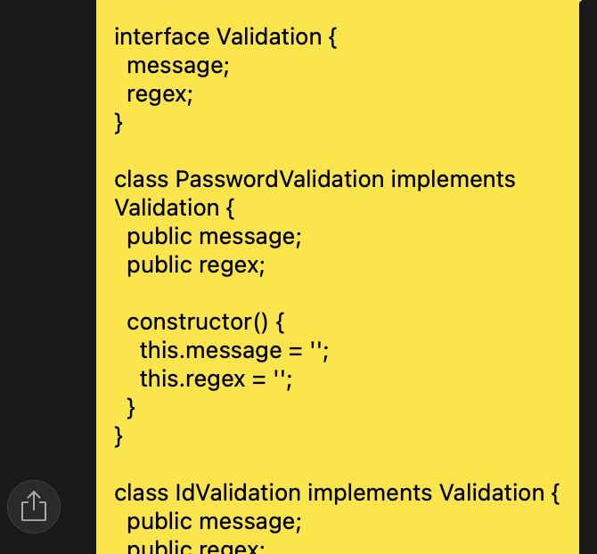

# Validator 구현에 좋은 코드 구성은?

:::success 📌 읽기 전에 보고 가세요!!
- 글 내용에 대한 오류 및 의견은 언제나 환영합니다.
- 해당 글은 주관적인 내용이 들어가 있습니다.
:::

## Validator 구현에 대한 토론

---

몇일 전, 카페에서 친구와 함께 모각코를 하다가 Validator 구현에 대한 이야기를 나누게 되었습니다. 친구는 로그인 쪽의 Validator에 대해 어떻게 구성할지 고민하고 있었고, 당시 메세지 키와 정규표현식 값을 통한 키밸류 형식의 Validator 를 구현한 상태였습니다. 그 형식은 밑과 같습니다.

```ts
const EMAIL_VALIDATOR = {
  'msg': regex
}

const PASSWORD_VALIDATOR = {
  'msg': regex
}
```

<!-- truncate -->

저나 친구나 둘 다 현재 코드에 대해 불만족스러운 부분이 있었고, 서로 고민하며 의견을 나누게 되었습니다. 리스트로 만드는 것부터 Enum을 활용하면 어떨지 등 여러 방안이 나오다가 갑자기 팩토리 패턴이 떠올랐습니다.

<br/>

## 팩토리 패턴은 어때?

---

팩토리 패턴은 각 Validator를 만들어주기 딱 좋아보이는 형태였고, **'이거다!!'** 하는 생각에 신나서 친구에게 설명하기 시작했습니다. 팩토리 패턴에 대한 설명으로 부족해서 이걸 어떻게 사용할 수 있을지에 대한 예제 코드까지 만들게 되었습니다. 친구가 프론트엔드 개발자라 TypeScript로 작성한 코드를 보여주었고 이를 적용하길 내심 기대했습니다. 이후, 해당 샘플 코드를 보내주었구요.



팩토리 패턴 외에도 다른 의견을 주고 받다가 어느 정도 이야기가 끝난 후, 각자의 코딩으로 돌아왔습니다. 모각코를 진행하다 저녁을 먹을 갈 시간이 되었고, 가기 전 Validator 코드가 어떻게 되었는지 궁금해서 어떻게 구현했냐고 물어보았습니다. 물어본 결과는 아직 결정한건 아닌데, 아마 리스트 방식을 사용할 것 같다고 답했습니다. (근데 리스트도 최선의 구현은 아닌 것 같다고 합니다.)

Hook으로 Validator 로직을 사용할건데, React에서 interface와 class를 사용해서 관리하는게 좋을지에 대해 고민이고 코드가 너무 많아지는 것도 이유가 있다고 하네요. 아쉽지만 친구가 저보다 프론트엔드를 오래 다뤘고, 다른 이유들도 이해가 되서 수긍하게 되었습니다.

<br/>

## Validator 팩토리 패턴 구현

---

그런데 이번에 팩토리 패턴을 써서 만들었던 Validator 코드가 아쉬웠습니다. 생각해보니 백엔드에서도 쓰일 것 같구요! 그래서 제대로 만들어보기로 했습니다. 처음엔 심플 팩토리 패턴으로 만들었지만 팩토리 메서드 패턴으로 만들어도 괜찮다고 생각해서 두 가지 모두 만들어봤습니다.

**밑의 구현은 모두 __Java__로 작성하였습니다.**

### Validator 클래스 작성

먼저 팩토리 패턴으로 만들 Validator 에 대한 코드를 작성해줍니다.

```java
public class EmailValidator implements Validator {
    private static final String ERROR_MESSAGE = "email need to have '@' and address";
    private static final String REGEX = "^[a-zA-Z0-9-]+@[a-zA-Z0-9-]+\\.[a-zA-Z0-9-.]+$";

    public String getErrorMessage() {
        return ERROR_MESSAGE;
    }

    public boolean isValid(String input) {
        Pattern pattern = Pattern.compile(REGEX);
        return !pattern.matcher(input).matches();
    }
}

public class LengthValidator implements Validator {
    private static final String ERROR_MESSAGE = "input is in wrong range";
    private static final int MAX_LENGTH = 20;
    private static final int MIN_LENGTH = 4;

    public String getErrorMessage() {
        return ERROR_MESSAGE;
    }

    public boolean isValid(String input) {
        if (input.length() > MAX_LENGTH) {
            return true;
        }
        return input.length() < MIN_LENGTH;
    }
}

public class PasswordValidator implements Validator {
    private static final String ERROR_MESSAGE = "password need to have 8 or more characters with a mix of letters numbers and symbols";
    private static final String REGEX = "^(?=.*[a-zA-Z])(?=.*\\d)(?=.*[!@#$%^&*()+=<>?/`]).{8,}$";

    public String getErrorMessage() {
        return ERROR_MESSAGE;
    }

    public boolean isValid(String input) {
        Pattern pattern = Pattern.compile(REGEX);
        return !pattern.matcher(input).matches();
    }
}
```

### 심플 팩토리 패턴

심플 팩토리 패턴은 Enum을 같이 활용했습니다. 개발자가 단순 String으로 객체를 생성해내는 것은 나중에 잊을수도 있고 인수인계에 어려움이 있으니까요.

```java
public enum ValidatorType {
    EMAIL,
    LENGTH,
    PASSWORD
}

public class ValidatorFactory {
    public Validator getValidator(ValidatorType type) {
        return switch (type) {
            case EMAIL -> new EmailValidator();
            case PASSWORD -> new PasswordValidator();
            case LENGTH -> new LengthValidator();
        };
    }
}
```

### 팩토리 메서드 패턴

팩토리 메서드는 각 팩토리 클래스가 너무 많아질 수 있다는게 단점이긴 한데, 심플팩토리처럼 분기문은 사용하지 않아도 되는 장점은 있습니다. 저는 이 코드가 좀 더 깔끔하다고 생각합니다.

```java
public interface ValidatorFactory {
    Validator getValidator();
}

public class PasswordValidatorFactory implements ValidatorFactory {
    public Validator getValidator() {
        return new PasswordValidator();
    }
}

public class LengthValidatorFactory implements ValidatorFactory {
    public Validator getValidator() {
        return new LengthValidator();
    }
}

public class EmailValidatorFactory implements ValidatorFactory {
    public Validator getValidator() {
        return new EmailValidator();
    }
}
```

## 끝으로

---

이렇게 팩토리 패턴을 사용해서 Validator를 만들어 보았고 저도 이게 최선인지는 모르겠습니다. 하지만 이렇게 Validator를 백엔드에서 사용하면 유용할 것 같다는 생각이 듭니다.

카페에서 이야기하다가 집에 와서 코드까지 짜게 된 재밌는 상황이었고, 다음에도 종종 이런 일이 있었으면 좋겠습니다.

<br/>

<div style={{"text-align": "right"}}> 최종 업데이트: 2023년 11월 11일 </div>
