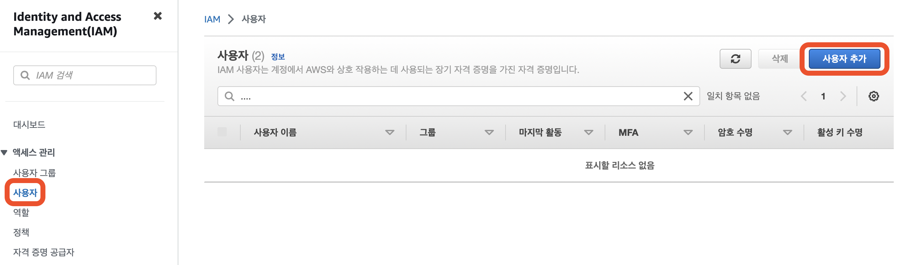
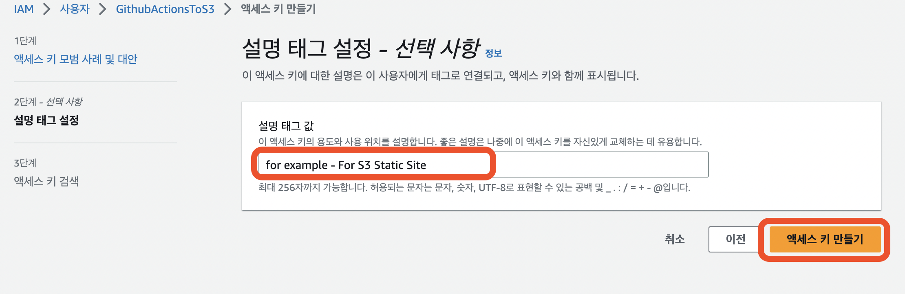
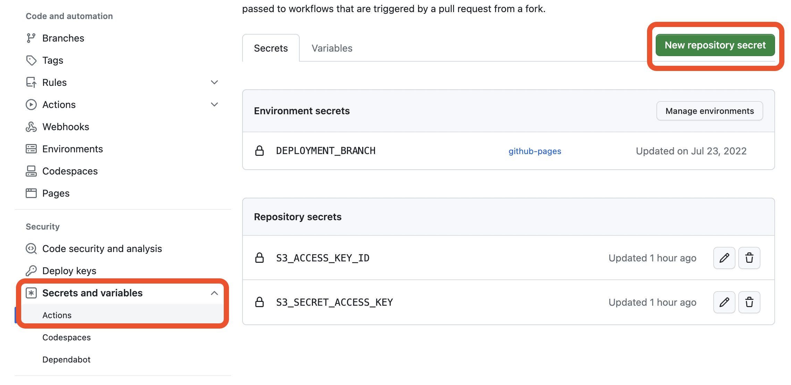
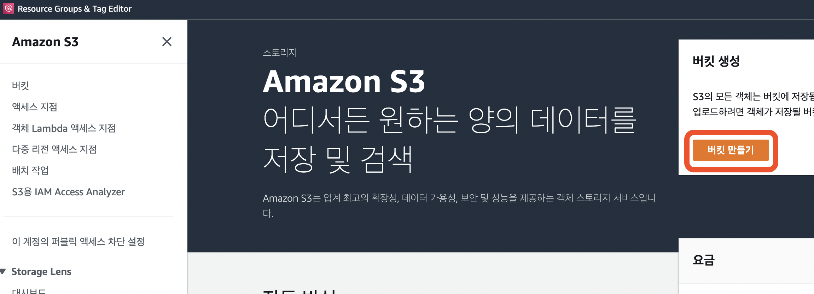
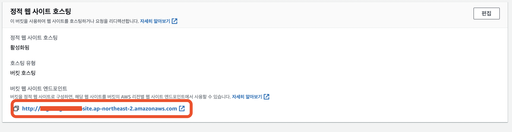

# GitHub Actions를 이용한 S3 정적 웹사이트 자동배포

## GitHub Actions Workflow 파일작성

먼저 자동 배포할 GitHub 레파지토리를 준비한다. 해당 레파지토리에서 `.github/workflows/{원하는 이름}.yml` 파일을 만든다. 이렇게 폴더와 파일을 만들면 GitHub에서 `.gitignore` 와 같이 `.github` 폴더를 인식한다. workflows 폴더 안의 파일들은 GitHub Actions 에서 돌아가게 되고 이 방식을 통해 자동배포를 설정할 수 있다.

파일에 대한 예시는 밑과 같다.

**deploy-S3.yml**

```yml
name: deploy S3 # Workflow 이름

on:
  push:
    branch: main # 원하는 브랜치 설정

env:
  NODE_VERSION: 18.x # Node 버전 설정
  INSTALL_COMMAND: yarn install # npm이면 npm install
  BUILD_COMMAND: yarn build # npm이면 npm run build
  AWS_REGION: ap-northeast-2 # 한국이면 ap-northeast-2 아니라면 AWS에서 확인
  AWS_S3_BUCKET: bucketname # S3 버킷 네임

###### 위만 알맞게 변경 ######

jobs:
  build-and-deploy:
    runs-on: ubuntu-latest
    steps:
      - name: git clone
        uses: actions/checkout@v3
      - name: set node version
        uses: actions/setup-node@v3
        with:
          node-version: ${{ env.NODE_VERSION }}
      - name: dependency install
        run: ${{ env.INSTALL_COMMAND }}
      - name: build
        run: ${{ env.BUILD_COMMAND }}
      - name: deploy
        env:
          AWS_ACCESS_KEY_ID: ${{ secrets.S3_ACCESS_KEY_ID }}
          AWS_SECRET_ACCESS_KEY: ${{ secrets.S3_SECRET_ACCESS_KEY }}
        run: aws s3 cp --recursive --region ${{ env.AWS_REGION }} build s3://${{ env.AWS_S3_BUCKET }}
```

💡 `jobs`에서 나중에 변경될만한 것들은 `env`로 빼두고 사용하면 재사용하기 쉽다.

### 워크플로우 요약

1. 코드를 레파지토리에 푸시한다.
2. 푸시를 캐치하여 작업물을 빌드한다.
3. 빌드한 결과물을 S3에 올린다.

## AWS IAM 설정

자, GitHub Actions 파일설정은 모두 끝났다. 하지만 이렇게 파일을 올리면 `deploy` 부분이 동작하지 않는다. 그렇기 때문에 밑의 코드에 대한 설정을 해줘야 한다.

**동작하지 않는 부분**

```yml
- name: deploy
  env:
    AWS_ACCESS_KEY_ID: ${{ secrets.S3_ACCESS_KEY_ID }}
    AWS_SECRET_ACCESS_KEY: ${{ secrets.S3_SECRET_ACCESS_KEY }}
  run: aws s3 cp --recursive --region ${{ env.AWS_REGION }} build s3://${{ env.AWS_S3_BUCKET }}
```

### IAM 사용자 생성

먼저 밑 부분은 IAM 설정과 관련이 있다. S3를 쓸 수 있는 계정을 AWS 에서 만들어 주어야 한다.

```
AWS_ACCESS_KEY_ID: ${{ secrets.S3_ACCESS_KEY_ID }}
AWS_SECRET_ACCESS_KEY: ${{ secrets.S3_SECRET_ACCESS_KEY }}
```

1. AWS Web Console에 접속 후, IAM 이라는 서비스로 들어간다.


2. 왼쪽 탭에서 사용자를 선택하고 새로운 사용자를 만든다.



3. 원하는 이름을 설정한다. 이 때, 나중에 어떤 곳에 쓰이고 있는지 알 수 있는 이름으로 설정해주면 좋다.


4. 직접 정책 연결을 선택 후, 원하는 권한을 부여한다. `AmazonS3FullAcees` 권한은 S3에 접근할 수 있는 모든권한을 뜻한다. 권한을 설정 했다면 다음으로 눌러 검토 및 생성 단계로 넘어간다.


5. 앞에서 잘 설정했다면 문제없이 사용자 생성을 누르면 된다.


### IAM Access Key 획득

이제 생성한 사용자를 GitHub Actions 에서 쓸 수 있도록 Access Key 를 얻을 것이다.

1. 만들어진 사용자의 정보를 클릭하면 **보안 자격 증명**이라는 탭을 볼 수 있다.


2. 해당 탭의 밑에는 **액세스 키**라는 탭이 있다. 만들기를 눌러 진행한다.


3. 사용 사례를 정하는데, 우리는 외부 GitHub Actions 에서 쓸거니 밑과 같이 선택한다.


4. 설명은 선택사항이지만 나중에 관리하기 쉽도록 하나 적어준다.



5. 만들어진 키는 이렇게 나오는데, 만들 때 **한 번 밖에 보지 못 한다.** 그러니 액세스 키와 비밀 액세스 키를 모두 안전한 곳에 잠시 보관하자.


## Access Key를 GitHub Secrets에 설정

IAM 사용자에서 Access Key를 얻었다면 이제 밑의 부분을 설정할 수 있게 되었다. 해당 키들을 `secrets`로 만들고 workflow에서 활용할 수 있게 된다.

```yml
AWS_ACCESS_KEY_ID: ${{ secrets.S3_ACCESS_KEY_ID }}
AWS_SECRET_ACCESS_KEY: ${{ secrets.S3_SECRET_ACCESS_KEY }}
```

이 키들을 `secrets`로 활용하기 위해선 GitHub 페이지에서 설정을 해주어야 한다.

1. 레파지토리에서 **Setting**으로 들어간다.


2. 왼쪽 탭에서 **Secrets and variables -> Actions** 로 들어가 레파지토리의 비밀 키를 만든다.



3. Name에는 원하는 키 이름. 그리고 Secret에는 방금 전 복사해둔 키를 입력한다.


이렇게 설정하면 `secrets`를 workflow에서 활용할 수 있게 된다.

## S3 버킷 생성

동작하지 않았던 코드 중 마지막 코드인 밑의 코드만 이제 동작하게 만들면 된다.

```yml
run: aws s3 cp --recursive --region ${{ env.AWS_REGION }} build s3://${{ env.AWS_S3_BUCKET }}
```

이 코드가 동작하지 않는 이유는 우리가 S3 버킷에 대한 권한을 주었다고 하더라도 S3 버킷을 만들지 않은 상태라는 것이다. 이제 S3를 만들어서 자동 배포를 완벽하게 해보자.

1. AWS Web Console 에서 S3로 들어간다.


2. S3 버킷을 생성한다.



3. 버킷에 대한 이름을 작성하고 리전을 선택한다. 해당 버킷 이름은 제일 위 `workflow` 코드에서 `env.AWS_S3_BUCKET` 에 써야한다. (서울리전이 아니라면 리전도 마찬가지로 다른 리전을 선택하고 코드를 바꿔준다.)


4. S3로 정적 웹사이트를 만들 것이기 때문에 `public access` 를 허용해주어야 한다. 그리고 생성을 누른다.


5. 이렇게 만들어진 S3에서 한 번 더 버킷 정책 권한을 설정 해주어야 한다. 권한을 들어간다.


6. 권한을 들어가서 스크롤을 내려보면 버킷 정책이라는 곳이 보일거고 해당 정책에 밑의 코드를 써 넣어 준다. `{버킷 이름}` 부분에는 방금 전 만들었던 버킷이름을 써줘야 한다. `arn:aws:s3:::s3example/*` 식으로 말이다.

```json
{
  "Version": "2012-10-17",
  "Statement": [
    {
      "Sid": "PublicRead",
      "Effect": "Allow",
      "Principal": "*",
      "Action": "s3:GetObject",
      "Resource": "arn:aws:s3:::{버킷 이름}/*"
    }
  ]
}
```

7. 속성으로 들어간다. 여기를 들어가는 이유는 정적 웹 호스팅 설정을 하기 위함이다.


8. 맨 밑으로 내리면 정적 호스팅에 대한 설정이 나온다.


9. 편집을 누르고 들어가서 정적 웹 사이트 호스팅 활성화를 누르고 인덱스 문서에는 `index.html` 을 설정해 준다. 왠만하면 `index.html` 이긴 한데, 독특한 프레임워크라면 다를 수도 있으니 빌드되는 파일을 한 번 확인해보길 권장한다.


10. 이렇게 설정이 끝나고 나면 정적 웹 사이트 호스팅이 완성되고, 밑에 엔드포인트가 생성된다.



## 끝으로

이제 코드를 지정한 브랜치에 푸시한 후, `workflow`가 모두 돌아가면 엔드포인트에서 내 결과물을 확인할 수 있다.
