# CloudFront 정적 웹사이트 배포

S3 정적 웹사이트는 AWS에서 붙여준 주소를 사용하며, http로 되어있다. 이걸 개인 도메인 및 https로 변경하기 위해 CloudFront를 사용하여 배포해보자.

**준비물**

- 개인 도메인 (Route53에서 구매)
- [S3 정적 웹사이트](https://blog.taewan.link/docs/CICD/github-actions-for-s3)

## CloudFront 배포

### 1. CloudFront 접속

AWS에서 CloudFront 서비스로 접속한다.

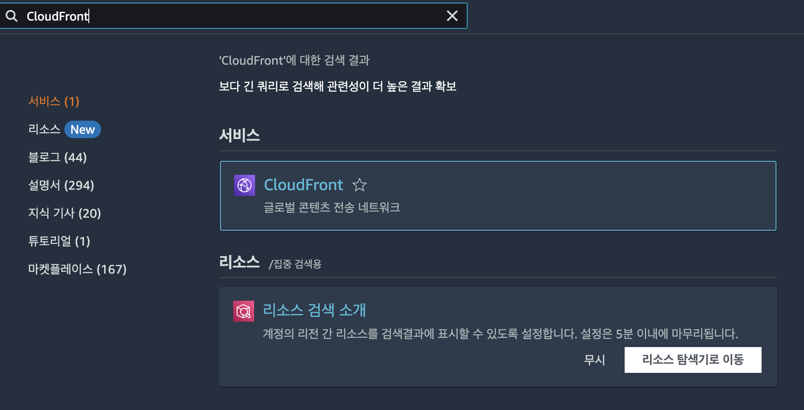

 

### 2. 배포 선택

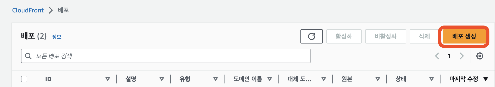

 

### 3. 원본 도메인 선택

원본 도메인을 선택한다. S3에서 만들어놨던 정적 웹사이트가 선택지로 뜰 것이고 해당 도메인을 선택한다.

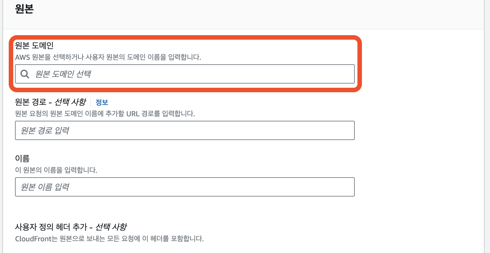

 

선택하고 나면 Web-Endpoint로 바꿀거냐고 물어보는데, 사용한다고 눌러주면 된다.

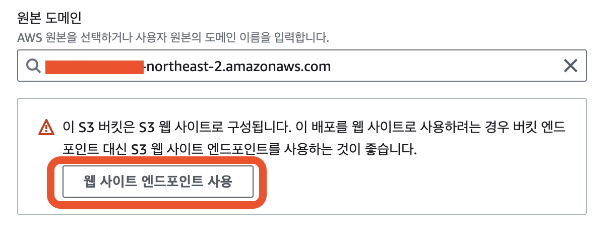

### 4. 그 외 설정

https에 대한 설정은 원하는대로 하면 된다. 이번 건 프론트라 https만 하는 선택지는 필요없을 것 같아, http -> https 리다이렉팅을 선택했다.

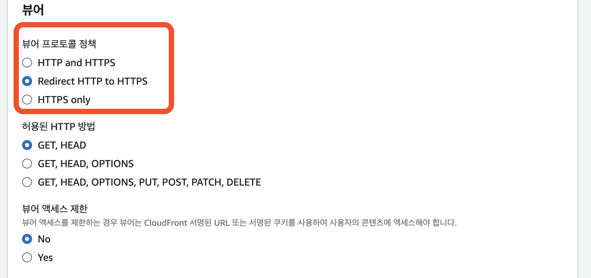

 

캐시설정도 임의로 하면 되지만 권장하는걸 쓰는게 나아보여 가만히 두었다.

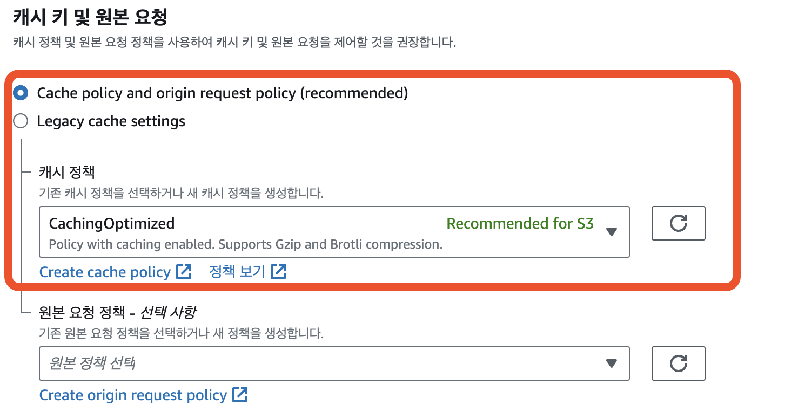

 

지역은 한국에서 쓸거라 Asia가 포함된 비용잉 제일 싼 선택지를 골랐고, WAF도 프론트라 필요없을 것 같아 비활성화했다.

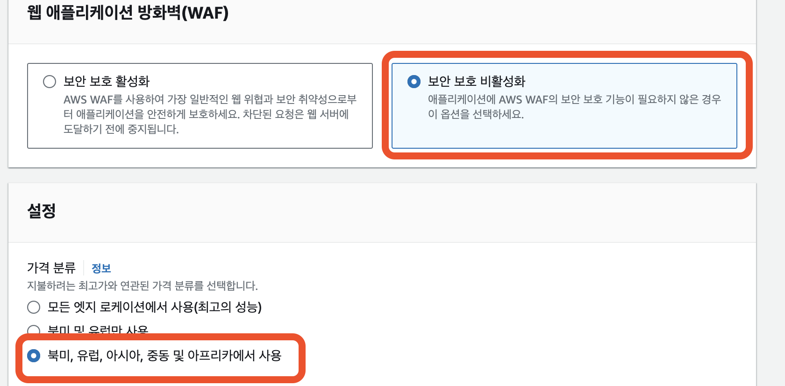

 

### 5. ssl 설정

ssl 설정은 인증서를 이미 받아놨다면 해당 인증서를 선택하면 된다. 인증서가 없다면 인증서 요청을 누르고 진행하면 된다. 인증서 요청 진행은 [ACM 설정](#acm-설정)을 참고하면 된다.

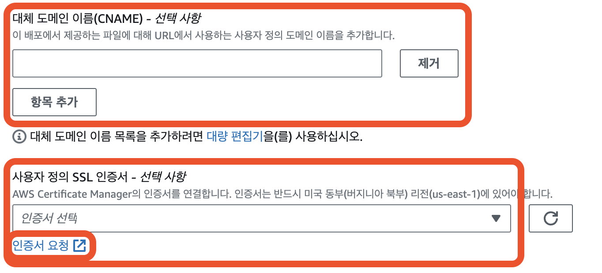

 

선택하면 밑과 같이 된다. CNAME은 선택사항이지만 같은 도메인으로 입력해주자.

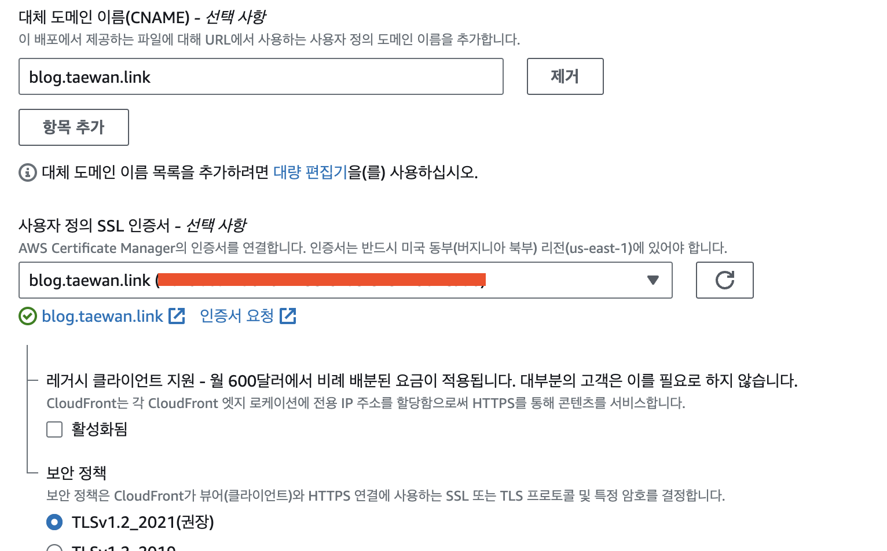

이렇게 해서 CloudFront 배포가 끝이 났고 Route53 설정을 해주면 원하는 URL로 접속할 수 있다.

 

## ACM 설정

Route53 설명 전, ssl 인증서가 없을 경우에 대해 간단하게 설명하고 넘어간다.

### 1. 인증서 요청

퍼블릭 인증서 요청을 선택하고 다음으로 넘어간다.

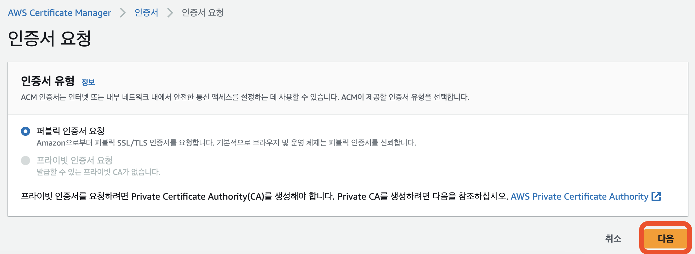

 

### 2. 도메인 작성

원하는 도메인을 입력하고 만든다.

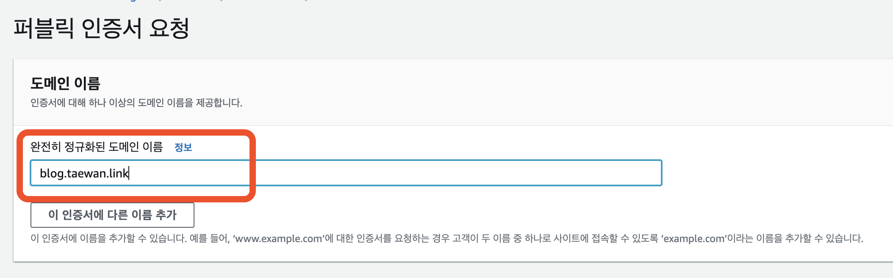

### 3. 도메인 인증

만들어진 인증서는 바로 작동이 안되는데, 해당 인증서에서 Route53에서 인증하는 레코드를 작성해주어야 동작한다.

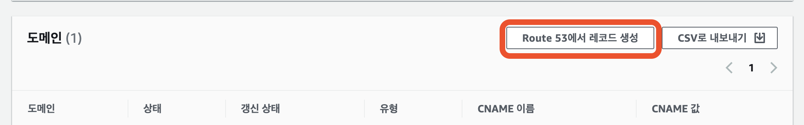

이 후, 조금만 기다리면 CloudFront 선택창에서 확인할 수 있게 된다.

 

## Route53 설정

### 1. Route53 접속

AWS에서 Route53 서비스로 접속한다.

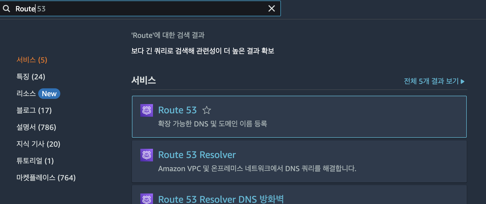

 

### 2. Record 작성

호스팅 영역에서 사용할 도메인을 선택하고 레코드를 생성해준다. 레코드 유형을 `A`로 하여 AWS 서비스들과 연동하면 된다. 이 때, 별칭을 클릭하여 라우팅 대상을 CloudFront로 쉽게 선택할 수 있다.

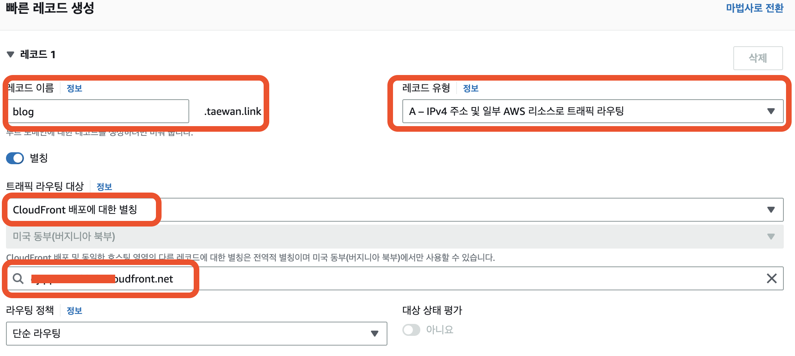

잠시 기다리면 배포가 완료되어 S3 정적 웹사이트를 https인 원하는 도메인으로 접속 가능하게 된다.

 

## 오류 페이지 설정

이렇게 설정 후에 들어가보면 URL 루트페이지는 잘 들어가지지만 하위 페이지는 URL로 직접 접속이 불가능 한 것을 확인할 수 있다. 이럴 때는 CloudFront 오류 페이지 설정에서 404로 이어지는 에러를 `/index.html`로 변경해주면 정상작동하게 된다.

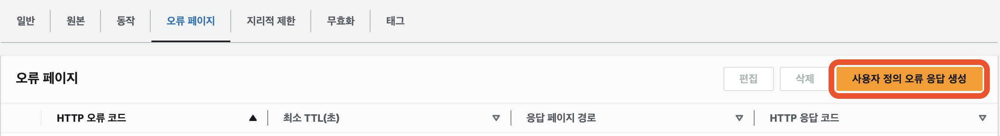

 

HTTP 오류 코드에서 404가 아닌 다른 오류도 지정하고 싶다면 더 지정해서 저장해줘도 된다.

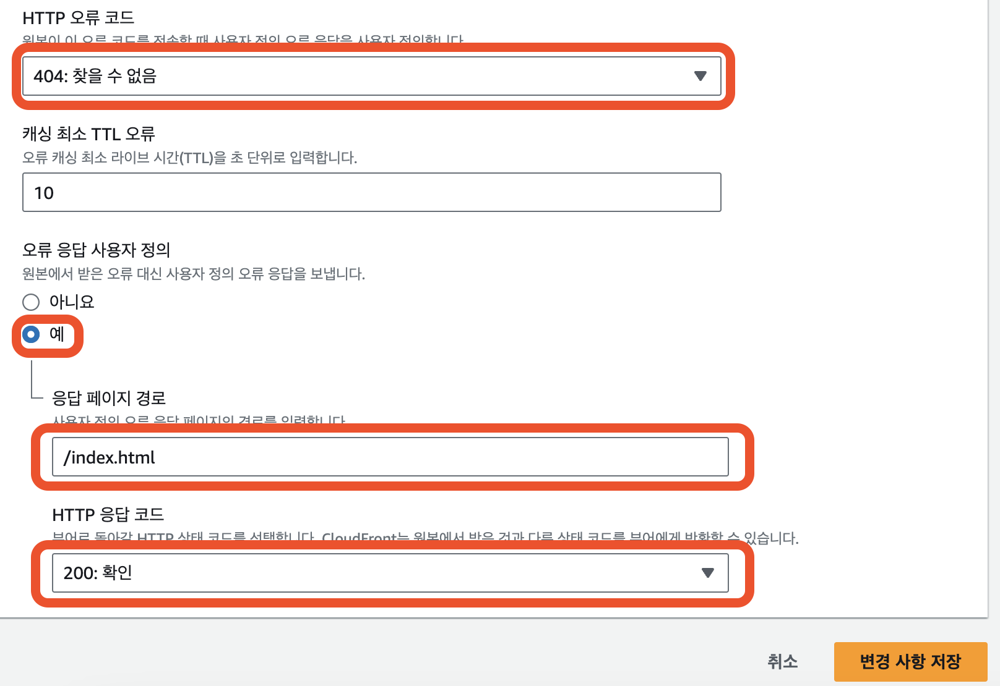

 
