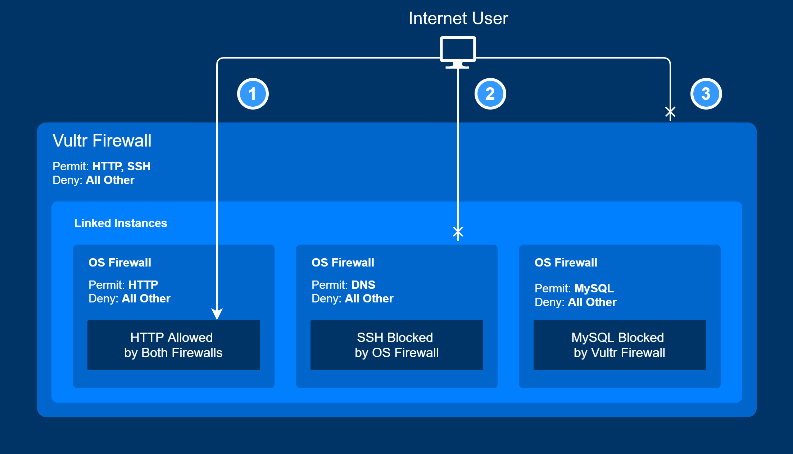

# Vultr UFW 설정

:::info
UFW(Uncomplicated FireWall)란 Ubuntu에서 작동하는 Linux Kernel Packet Filtering System(Netfilter)이다. 오픈소스 OS 방화벽 툴이라고 알면 된다.
:::

<br />

## Vultr 방화벽 동작 방식

Vultr와 AWS에서도 Web Console에서 설정하는 방화벽은 같다. 밑의 Vultr Firewall이라는 곳이 Web Console에서 설정하는 부분이고, Vultr에서는 인스턴스가 2개 이상 생길 시, OS Firewall(UFW)를 기본적으로 설정되어 있다. Vultr Firewall을 거쳐 한 번 더 OS Firewall에서 걸러지게 된다. ~~나도 방화벽설정도 제대로 하고 서비스를 띄웠는데, 서비스가 제대로 동작안해서 Vultr에 티켓보내서 알게 되었다...~~



<br />

:::info
[공식문서](https://www.vultr.com/docs/vultr-firewall/) 참고
:::

<br />

## 설정 명령어 종류

### 활성화

```bash
# 활성화
sudo ufw enable
# 비활성화
sudo ufw disable
```

### 상태 확인

```bash
sudo ufw status
# 좀 더 상세한 상태 확인
sudo ufw status verbose
```

### 디폴트 설정

```bash
# 처음 설정으로 돌아감
sudo ufw reset
```

### 포트 설정

```bash
# 기본적으로 들어오는 모든 포트 거절
sudo ufw default deny incoming
# 기본적으로 나가는 모든 포트 승인
sudo ufw default allow outgoing
# HTTP(80) 승인
sudo ufw allow 80/tcp
# HTTPS(443) 승인
sudo ufw allow 443/tcp
```

### 재기동

```bash
# 설정 후, 재기동은 필수
sudo ufw reload
```

### 예제

```bash
sudo ufw default deny incoming
sudo ufw default allow outgoing
sudo ufw allow 80/tcp
sudo ufw allow 443/tcp
sudo ufw enable
sudo ufw reload
```

<br />

:::info
[공식문서](https://www.vultr.com/docs/firewall-quickstart-for-vultr-cloud-servers/#Uncomplicated_Firewall__UFW__Quickstart) 참고
:::

<br />
