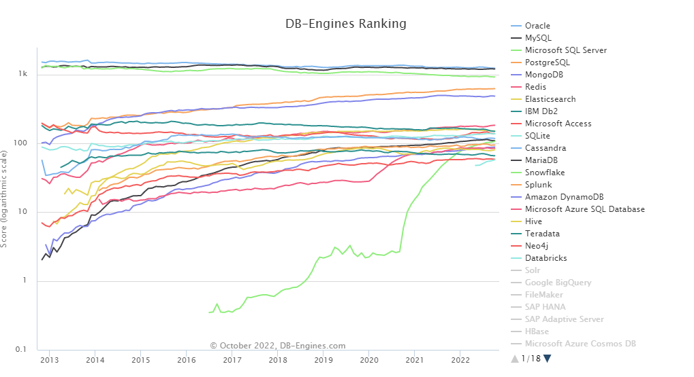

# DB 선정과정 예시

:::note
새로운 사이드 프로젝트를 들어가기에 앞서 데이터베이스를 선정하는 과정을 가졌다. 어떤 기준으로 데이터베이스를 선정해볼까? 라는 생각을 가졌고, 여러 기준을 선정하고 각 기준에 기대치 이상을 가지는 DB들을 선택하고, 차차 줄여나가보기로 했다.

사이드 프로젝트: https://github.com/sundayTen/pokr-server
:::

## 첫 번째 기준, 상용화와 레퍼런스

현재 우리 상태를 먼저 생각하고 선정 시작을 해야 할 것 같았다. 우리는 DBA가 아니다. 개발자일 뿐이고, DB에 대해서 엄청난 튜닝을 할 리소스는 없다. 그러므로 상용화가 잘 되고, 에러 대응을 위한 레퍼런스도 충분히 있어야 했다. 때문에 현재 DB 랭킹부터 뜯어보았다.

> 참고 사이트: https://db-engines.com/en/ranking  
> 랭킹 기준: https://db-engines.com/en/ranking_definition

이렇게 보았을 때, 20위까지는 써봐도 될 것 같았고, Snowflake, Databricks는 탄생한 기간이 오래되지 않아서 제외시켰다.

**✅ 남은 DB 목록: ElasticSearch, Microsoft Access, Cassandra, Splunk, Hive, Teradata, Neo4j, Oracle, MS SQL Server, IBM Db2, AWS DynamoDB, Azure SQL Database, MySQL, PostgresQL, MongoDB, Redis, SQLite, MariaDB**

## 두 번째 기준, 서비스 DB

여러 DB를 보았을 때, 데이터를 위한 DB가 많았다. 우리는 서비스를 만들기 위한 DB를 찾고 있으므로, 데이터 전용 DB들은 다 제외하기로 했다.

데이터 관련 DB: ElasticSearch, Microsoft Access, Cassandra, Splunk, Hive, Teradata, Neo4j

**✅ 남은 DB 목록: Oracle, MS SQL Server, IBM Db2, AWS DynamoDB, Azure SQL Database, MySQL, PostgresQL, MongoDB, Redis, SQLite, MariaDB**

## 세 번째 기준, 비용

우리는 BM을 낼 예정이므로 상업용 데이터베이스는 사용할 수 없다. 비용적인 측면에서 몇몇 데이터베이스를 제외하기로 하였다. 나중에 구독서비스를 사용할 수도 있지만, 현재는 비용을 아끼는데 초점을 두었다.

**✅ 남은 DB 목록: MySQL, PostgresQL, MongoDB, Redis, SQLite, MariaDB**

## 네 번째 기준, Update 성능

서비스가 매일 트래킹하는 부분이 많기 때문에 자기가 목표했던 key-result나 달성 수치를 변경하는 일이 잦다. 그렇기 때문에 update 성능이 괜찮은 DB를 선택해야 했다.

Postgresql과 Mysql에 대한 글들이 엄청 많았고, 글들을 보며 Postgresql이 훨씬 성능이 좋다는 이야기를 알게 되었다. 하지만 우리가 원하는건 Update의 성능이다. 근데, Postgresql은 insert, delete 방식으로 update를 하다보니 mysql보다 성능이 떨어지게 된다. 물론 NoSQL에서는 그런방식으로 업데이트를 하면 빨리지기도 한다. 하지만 ORDBMS인 Postgresql은 그런 방식을 택한게 다른 부분의 성능을 끌어올리기 위해 필수불가결하게 선택한 것으로 보인다.

**✅ 남은 DB 목록: MySQL, MongoDB, Redis, SQLite, MariaDB**

> 여담으로 Uber에서는 mysql -> postgresql -> mysql로 변경한 이력도 있다. DB 재해복구 때문인데, 읽기 속도를 끌어올리기 위해 postgreql이 선택했던 방식이 재해복구에서는 단점을 끌어내와서 바꿨다고 한다. 우버 이야기도 흥미로웠고, 배민에서는 postgreql로 변경하며 성능이점을 정리한 부분도 흥미로웠다.
>
> https://uminoh.tistory.com/32   https://techblog.woowahan.com/6550/   https://www.youtube.com/watch?v=bNeZYVIfskc   https://ayende.com/blog/175137/re-why-uber-engineering-switched-from-postgres-to-mysql   https://www.yumpu.com/en/document/view/53683323/migrating-uber-from-mysql-to-postgresql

## 다섯 번째 기준, 서비스와 적합도

Sqlite는 경량용으로 쓰이며, 다중 사용자관리가 부족하고, 지원하는 타입도 부족하다. 그래서 test용으로 쓰일 때가 있고, 실제 서비스 용도로는 부적합했다.

Redis, Mongodb는 Nosql이다. 사이드 프로젝트에는 체인형식으로 관계가 되어 있는 부분이 많았는데, NoSQL로 관계형을 나타내기에는 어려움이 있고, CASCADE가 아닌 Triggering으로 데이터를 삭제하는 것은 더욱이 비용이 커 보였다. 그리고 Redis는 캐시용도로 자주 사용되며, 인메모리 DB라 더욱 부적합하였다. 또한, 우리는 User 검색만 만들예정이기 때문에 내용기반 검색이 필요없었고, 이는 Nosql의 필요성이 와닿지 않게 되었다.

**✅ 남은 DB 목록: MySQL, MariaDB**

> https://gocoding.org/ko/difference-between-sqlite-and-mysql/   https://blossoming-man.tistory.com/entry/MongoDB%EB%A5%BC-%EC%8D%A8%EB%B3%B4%EB%8B%A4   https://zangzangs.tistory.com/72

## 마지막 결정 - MySQL 선정

마지막으로 Mysql과 MariaDB가 남게 되었고, 둘 중 하나를 사용하기로 하였다. 여러 문서를 보면, MariaDB를 찬양하는 글들이 있는데, 왜 트렌드 그래프에서는 Mysql보다 떨어지는 것일까? 예전 기업들이 이미 Mysql을 사용하고 있고 그걸 MariaDB로 변경할 이유를 찾지 못 해서가 아닐까 하는 생각이 든다.

Maria DB는 여러 면에서 Mysql의 대체제가 되었고, 기능 또한 Mysql이 가지고 있지 못 한 기능을 더 가지고 있다고 한다. 밑에 보면 mysql을 mariaDB로 바꿔야 하는 10가지 이유가 나와있는데, 스토리지 엔진도 다양하게 지원하고, 컨트리뷰터도 Mysql보다 많으며, 더 오픈되어있는 오픈 라이브러리에, master-slave 복제가 아닌 master-master 복제를 지원한다고 한다.

문제점은 mysql과 호환이 될까라는 문제이다. 15년이전에는 거의 무조건 호환이라고 했는데, 버전이 업데이트될수록 호환의 문제점이 생기고 있다고 한다. 나중에 cloud로 옮길 때, Aurora를 고려하고 있었는데, 과연 MariaDB가 Aurora(Mysql, Postgresql 호환)에 바로 마이그레이션이 가능할까라는 생각이 든다.

MariaDB가 Mysql에 비해 엄청난 이점을 가지고 있다면 MariaDB를 고려해보았겠지만, 나중에 더 좋은 DB로 마이그레이션하는 것과 호환성의 문제가 생길 수 있는 단점이 존재하여 Mysql로 결정하게 되었다.

**✅ DB 선정: MySQL**

> https://linuxnatives.net/2015/10-reasons-to-migrate-to-mariadb-if-still-using-mysql   https://loosie.tistory.com/366   https://kinsta.com/blog/mariadb-vs-mysql/   https://joalog.tistory.com/52
