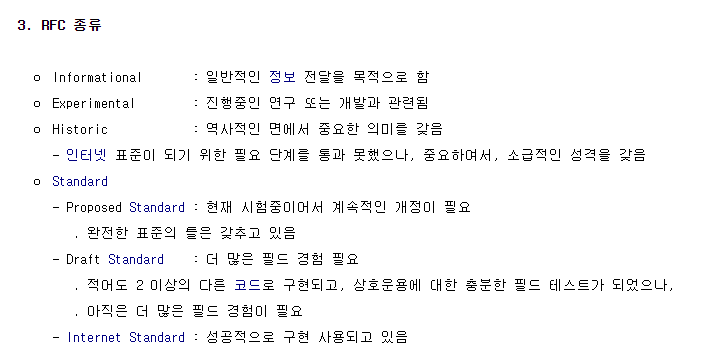
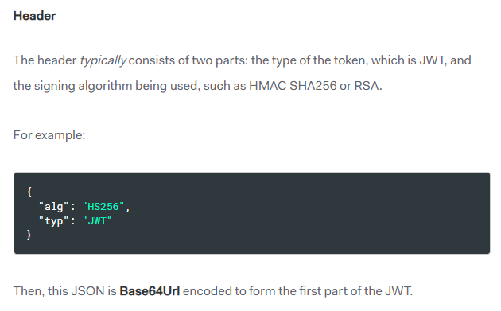
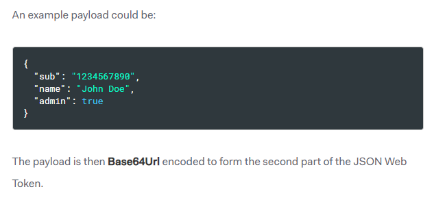
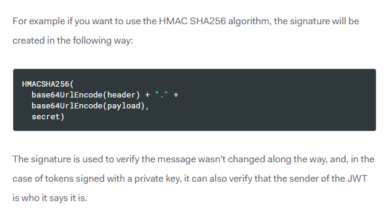
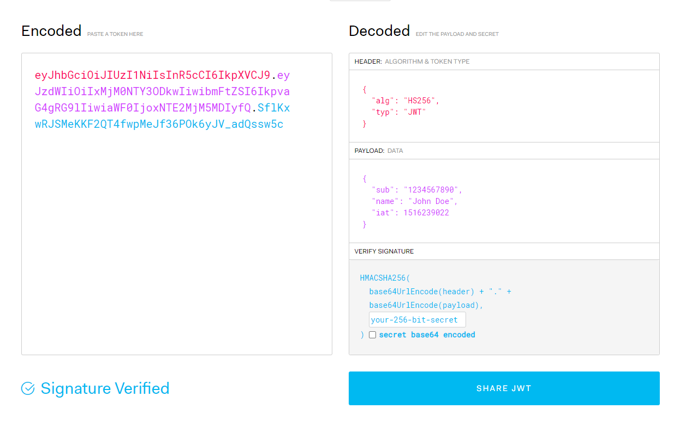

# JWT

## RFC 문서내용

* 두 그룹간에 JWT를 통해 디지털 서명이나 무결성 보호를 한다.
* JWT는 대표적으로 JWS, JWE 두 가지로 나뉘고 이를 포괄하는 인터페이스이다.

 

:::info

RFC란 Request for Comments의 약자로써, 컴퓨터 네트워크 공학 등에서 인터넷 기술에 적용 가능한 새로운 연구, 혁신, 기법 등을 아우르는 메모를 나타낸다. JWT는 RFC의 Internet Standard에 속한다. Internet Standard란 RFC의 종류로써, 이런 종류들이 있다.

[RFC 문서](ktword.co.kr/abbr_view.php?nav=&m_temp1=177&id=420) 참고
:::

 

## 요약

JWT 공식사이트에서는 이렇게 3가지로 요약한다.

1. JWT란 JSON 객체로 된 정보를 치밀하고 독립적인 방법으로 서로 간에 안전하게 전송하는 것을 말한다.
2. JWT는 디지털적으로 서명되어 안전한데, HMAC 알고리즘의 암호화나 RSA, ECDSA 공개/개인키방식을 사용하여 서명된다.
3. 토큰으로 무결성을 확인할 수 있지만, 개인키를 보유한 서버빼고 모두에게 데이터를 숨긴다.

 

## 암호화 방식

위 에서 HMAC 알고리즘의 암호화가 사용된다고 했다. HMAC이 뭘까? HMAC을 알기 위해선 MAC부터 알아야 한다.

### MAC

MAC은 Message Authentication Code로써, 메세지 인증에 쓰이는 작은 크기의 정보이다.

이 MAC은 어떤 한 메세지를 통해서 만들어진다. 송신자는 MAC 알고리즘과 시크릿 키 값으로 메세지 값을 MAC으로 만들어낼 수 있다. 그러면 이 MAC과 메세지를 같이 수신자에게 보낸다. 수신자는 해당 메세지를 수신자가 가지고 있는 MAC 알고리즘과 시크릿 키 값으로 MAC을 만들어 내고, 송신자에게 받은 MAC과 수신자가 만들어 낸 MAC이 같은지를 비교하게 된다. 송신자의 MAC과 수신자의 MAC이 같다면 정상적인(인증된) 송수신이라는 것을 알게 된다.

### HMAC

HMAC은 해시라는 것이 MAC에 붙은 것이다. 해쉬 키와 알고리즘을 통해 MAC을 만들어내고 메세지와 MAC을 비교하는 것! MAC과 해시를 이해한다면 HMAC의 개념은 따라온다고 보면 된다.

 

## JWT

사실, 우리가 주로 쓰고 있는 JWT는 JWS이다. 즉, 우리가 JWT라고 부르는 것에는 여러 종류가 있고, JWT는 하나의 인터페이스라는 뜻이다. 현재 대표적으로 나뉘는 JWT는 JWS와 JWE가 있다. 우리는 주로 JWS를 사용하고 있어서 몰랐을 뿐이다.

### JWS vs JWE

#### 구조

|JWS|JWE|
|---|---|
|JOSE header|JOSE header|
|payload|Encrypted Key|
|signature|Initialization vector|
||Additional Authentication Data (AAD)|
||Ciphertext|
||JWE Authentication Tag|

#### 표현 형식

||JWS|JWE|
|---|---|---|
|형식 예시| xxxxx.xxxxx.xxxxx | xxxxx.xxxxx.xxxxx.xxxxx.xxxxx|

구조가 JWS 3개, JWE 6개로 다르다보니, 각 파트마다 닷(.)으로 구분한다. 그래서 닷(.)의 개수를 보면 바로 구분 가능하다. 하지만 위에서 보면 오른쪽의 닷으로 나뉘어져있는 것은 6개가 아닌 5개이다. 이는 마지막 나뉘어진 부분에 Ciphertext, JWE Authentication Tag가 같이 처리되기 때문이다.

:::info
[공식문서](https://datatracker.ietf.org/doc/html/rfc7516) 참고
:::

 

### JWS 구조 세부사항

#### Header

헤더에는 `typ`과 `alg`라는게 들어간다. `typ`은 어떤 유형(데이터 타입)인지를 나타내는 것이고 `alg`는 어떤 알고리즘을 적용할지 정하는 곳이다. 알고리즘은 대표적으로 RS256(RSA SHA256 - 공개키 방식)과 HS256(HMAC SHA256 - 대칭키 방식)을 쓴다. 다 작성되면 Base64Url 인코딩을 한다.

#### Payload

페이로드도 위와 같은 형식으로 작성되는데, 안에 있는 키값들은 정해져 있는 것도 있고 커스텀해서 넣을 수도 있다. 정해져 있는 것을 클레임 셋이라고 하는데, 이 클레임 셋들을 사용해서 작성하는게 낫다. 마찬가지로 다 작성되면 Base64Url 인코딩을 한다.

:::info
[정해진 클레임 셋](https://datatracker.ietf.org/doc/html/rfc7519#section-4.1) 참고
:::

#### Signature

마지막 서명은 header와 payload와는 다른 형식이다. 위의 헤더와 페이로드를 인코딩한 것을 시크릿(솔팅 비슷한 개념)을 추가하여 시크릿 키를 알고 있는 사람인지 판별할 수 있게 만든다. 즉, 밑의 서명이 정확해야 이 키는 진정한 JWT라고 볼 수 있는 안전장치인 셈이다.

:::info
[JWT 공식문서](https://jwt.io/introduction) 참고
:::

 

### JWT 생성 사이트

이렇게 JWT를 만들 수 있는데, [실제로 만들 수 있는 사이트](https://jwt.io/#debugger-io )가 있다. 사이트에 들어가면 밑의 사진처럼 해볼 수 있다.

 
