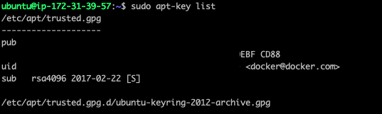
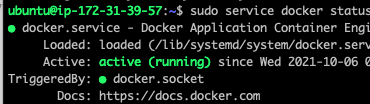

# Docker

## 도커 설치

### 필수 패키지 설치

- `apt-transport-https` : 패키지관리자가 https를 통해 패키지 다운로드가 가능하게 한다.
- `ca-certificates` : ca-certificate는 디지털 서명을 위한 패키지이며, SSL 인증서의 PEM 파일과 업데이터가 포함되어 있다.
- `curl` : 웹사이트에서 데이터를 내려받는다. 해당 패키지는 이미 다운로드되어 있을 확률이 높다. 이미 되어 있다면 빼도 된다.
- `gnupg-agent`: GPG Key를 관리하기 위한 패키지이다.
- `software-properties-common` : PPA를 추가하거나 제거할 때 사용한다. 이것이 없다면 수동으로 레파지토리를 추가 및 제거해야한다. 

**전체 설치**
```bash
sudo apt-get install apt-transport-https ca-certificates curl gnupg-agent software-properties-common
```

:::info
PPA란? Personal Package Archive, 개인 패키지 저장소. 즉, 레파지토리를 뜻한다.

**위의 패키지에 대한 참고**
* http://manpages.ubuntu.com/manpages/focal/man1/apt-transport-https.1.html
* https://launchpad.net/ubuntu/xenial/+package/ca-certificates
* http://manpages.ubuntu.com/manpages/xenial/man8/update-ca-certificates.8.html
* https://askubuntu.com/questions/1000118/what-is-software-properties-common
:::


### GPG Key 인증

```bash
# 인증 및 추가
curl -L https://download.docker.com/linux/ubuntu/gpg | sudo apt-key add -
# 확인
sudo apt-key list
```

`GPG Key`: 해당 레파지토리를 다운받기 위한 공개 키 (파일이 위변조되지 않았는지 공개키로 검증한다.)

> 참고: https://happycloud-lee.tistory.com/145

밑과 같이 키를 받았는지 확인할 수 있다.




### Docker Repository 등록

아키텍쳐를 확인하고 해당 서버의 아키텍쳐대로 레파지토리를 등록한다. stable버전 레파지토리를 권장한다.

```bash
# 아키텍쳐 확인
dpkg --print-architecture
# 나오는 타입대로 설치 - 현재 aws t2.micro 20.04버전은 amd64
sudo add-apt-repository "deb [arch=amd64] https://download.docker.com/linux/ubuntu $(lsb_release -cs) stable"
```


### 도커 설치

레파지토리를 등록하면 apt-get을 한 번 업데이트해주어야 한다. 그리고 도커 설치를 진행한다. 3가지를 설치하는데, 오픈소스 도커와 CLI 그리고 리눅스에서 데몬으로 돌릴 수 있는 패키지를 설치하게 된다.

```bash
sudo apt-get update && sudo apt-get install docker-ce docker-ce-cli containerd.io
```

> What is docker-ce?
>
> Docker CE is **a free and open source containerization platform**. It is a rebranded version of the Docker open source solution that has been freely available since the launch of Docker in 2013. CE can run on Windows 10 and Mac, on Azure and AWS, as well as CentOS, Debian, Fedora, and Ubuntu.
>
> What is containerd.io?
>
> containerd is available as **a daemon for Linux and Windows**. It manages the complete container lifecycle of its host system, from image transfer and storage to container execution and supervision to low-level storage to network attachments and beyond.


### 도커 확인

도커가 잘 설치되었는지 상태 확인한다.

```bash
# 시스템 부팅시 도커 시작
sudo systemctl enable docker && sudo service docker start
# 도커 확인
sudo service docker status
```

밑과 같이 뜨면 성공이다.




### 도커 사용자 인증

도커를 `sudo`  명령어 없이 사용하기 위해 도커 실행그룹을 등록한다.

`sudo usermod -aG docker $(whoami)` - 현재 사용자를 도커 실행그룹에 포함시킨다.

`sudo chmod 664 /var/run/docker.sock` 그래도 안되면 도커 소켓의 권한을 추가한다.


## 컨테이너 실행

현재 과정은 fastapi를 기준으로 설명한다.

### 도커파일 작성

```Dockerfile
FROM python:3.8
COPY ./requirements.txt requirements.txt
COPY ./.env .env
RUN pip3 install -r requirements.txt
COPY . .
EXPOSE 8000
CMD ["python3", "run_server.py"]
```

* `FROM`: 기본 베이스가 되는 환경을 뜻한다. `:` 뒤의 숫자는 태그를 뜻하며 다양한 버전으로 있다.
* `COPY`: 파일이나 폴더를 도커파일의 위치한 경로를 중심으로 컨테이너 안에 복사한다.
* `RUN`: 컨테이너 내에서 실행할 명령을 설정한다. 해당 명령이 끝난 후에는 베이스 환경에 레이어처럼 명령 행의 결과가 덧 입혀진다. 또한 해당 `RUN`이 성공하면 그 해당 레이어는 세이브포인트가 되어, 다음 빌드 단계에 오류가 나도, 성공한 RUN에서부터 빌드를 시작한다.
* `EXPOSE`: 외부로 노출시키는 포트를 지정한다.
* `CMD`: `RUN` 처럼 명령을 실행시키는 것은 같다. 하지만 해당 명령은 docker run에서 인자값들을 전달하면 해당 명령(`CMD`)이 무시된다. 즉, `/bin/bash` 같은 인자를 넣어서 `bash` 창으로 컨테이너에 들어갈 때는 `CMD`가 실행되지 않는다.
* `RUN`, `CMD`, `ENTRYPOINT` 비교 참고: https://show-me-the-money.tistory.com/entry/Docker-%EB%AA%85%EB%A0%B9%EC%96%B4-RUN-CMD-Entry-Point%EC%9D%98-%EC%B0%A8%EC%9D%B4%EC%A0%90%EC%97%90-%EB%8C%80%ED%95%B4%EC%84%9C


### .env 파일 작성

환경변수들을 .env파일에 모아서 관리한다. 보안이 필요하기 때문에, git에는 절대 올리지 않고, 내부에서 전달한다.

`sudo bash "sudo cat > .env"` 같은 명령어를 통해 .env를 로컬 EC2상에서 직접 만든다.


### 빌드 및 실행

```bash
# 이미지 생성
docker build -t server_test:latest .
# 컨테이너 실행
docker run -d -p 8000:8000 --name server_test -v /etc/localtime:/etc/localtime:ro server_test:latest
```


## 도커 주요 명령어

* `docker ps`: 현재 실행 중인 컨테이너 확인
* `docker ps -a`: 현재 생성된 모든 컨테이너 확인
* `docker images`: 현재 생성된 모든 이미지 확인
* `docker rmi ${image_id}`: 도커 이미지 제거, 이름으로도 되며, id 앞의 몇 글자만 써도 된다.
* `docker rm ${container_id}`: 도커 컨테이너 제거, 이름으로도 되며, id 앞의 몇 글자만 써도 된다.
* `docker stop ${container_id}`: 컨테이너 중지, 이름으로도 되며, id 앞의 몇 글자만 써도 된다.
* `docker start ${container_id}`: 중지된 컨테이너 실행, 이름으로도 되며, id 앞의 몇 글자만 써도 된다.
* `docker build`: 여러 옵션이 있으며, 이미지를 생성한다.
* `docker run`: 여러 옵션이 있으며, 컨테이너를 생성 및 실행한다.
  * `-v`: 해당 옵션이 중요한데, 로컬 우분투에 있는 폴더와 컨테이너의 폴더를 바인드마운트한다. 볼륨과 거의 똑같은 개념이며, 도커에서는 볼륨을 권장하고 있다.

<br/>
