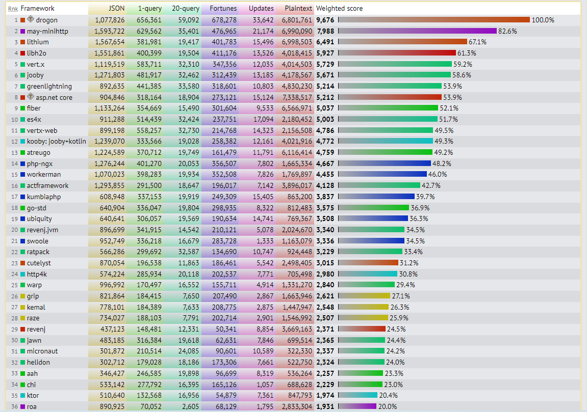

# 프레임워크 선정과정 예시

:::info
- 해당 과정은 2022년 8월을 기준으로 진행되었습니다.
- 6가지 부문에 각 프레임워크 별로 점수를 부여합니다.
- 0점인 프레임워크는 선정에서 제외됩니다.
- 점수 체계는 주관적임을 알려드립니다.
:::

## 후보군 설정

여러 프레임워크를 찾아보고 비교할 후보군을 설정한다. 현재 글에서는 8개를 선정하였다.

- echo
- beego
- gin
- martini
- fiber
- fasthttp
- atreugo
- gnet

## 깃허브 스타

깃 허브 스타는 사람들이 얼마나 해당 프레임워크에 관심이 있는지(범용성)를 뜻한다.

**🎯 점수 체계**

| 5점      | 4점      | 3점      | 2점      | 1점     | 0점     |
| -------- | -------- | -------- | -------- | ------- | ------- |
| 50k 이상 | 35k 이상 | 20k 이상 | 10k 이상 | 5k 이상 | 5k 미만 |

**깃허브 스타 수**

| echo | beego | gin   | martini | fiber | fasthttp | atreugo | gnet |
| ---- | ----- | ----- | ------- | ----- | -------- | ------- | ---- |
| 23k  | 28.6k | 61.5k | 11.5k   | 21.2k | 18.2k    | 912     | 6.7k |

**🎯 깃허브 스타 점수**

| echo | beego | gin | martini | fiber | fasthttp | atreugo | gnet |
| ---- | ----- | --- | ------- | ----- | -------- | ------- | ---- |
| 3    | 3     | 5   | 2       | 3     | 2        | 0       | 1    |

 

## 문서 유무

새로운 프레임워크를 배우기 위해서는 정돈된 문서의 존재가 매우 중요하다.

**🎯 점수 체계**

| 5점            | 4점         | 3점         | 2점         | 1점              | 0점       |
| -------------- | ----------- | ----------- | ----------- | ---------------- | --------- |
| 잘 정돈된 문서 | 정돈된 문서 | 볼만한 문서 | 부실한 문서 | 매우 부실한 문서 | 문서 없음 |

**🎯 문서 유무 점수**

| echo | beego | gin | martini | fiber | fasthttp | atreugo | gnet |
| ---- | ----- | --- | ------- | ----- | -------- | ------- | ---- |
| 5    | 5     | 3   | 3       | 5     | 3        | 1       | 1    |

 

## 정보의 접근성

프레임워크에서 일어나는 다양한 문제를 해결하기 위해 레퍼런스는 필수이기 때문에 정보의 접근성이 뛰어난지 확인한다.

**🎯 점수 체계**

밑과 같은 키워드로 구글 검색시, 1페이지에 스택오버플로우나 블로그 글이 뜨는지 확인한다.

- {framework}
- {framework} errorhandling
- {framework} router example
- {framework} mulipart upload
- {framework} async sample

| 5점      | 4점 | 3점 | 2점 | 1점 | 0점 |
| -------- | --- | --- | --- | --- | --- |
| 5개 모두 | 4개 | 3개 | 2개 | 1개 | 0개 |

**🎯 키워드 검색 점수**

| echo | beego | gin | martini | fiber | fasthttp | atreugo | gnet |
| ---- | ----- | --- | ------- | ----- | -------- | ------- | ---- |
| 3    | 4     | 5   | 3       | 5     | 4        | 4       | 1    |

 

## 업데이트 유무

프레임워크 업데이트가 최신이라면 프레임워크를 지속적으로 개발한다는 뜻이다. 그러므로 취약점이나 버그가 생길경우, 빠르게 고칠 수 있고, 꾸준한 기능 추가로 지속적인 사용에 도움이 된다.

**🎯 점수 체계**

| 5점        | 4점        | 3점        | 2점      | 1점      | 0점      |
| ---------- | ---------- | ---------- | -------- | -------- | -------- |
| 3개월 이내 | 6개월 이내 | 9개월 이내 | 1년 이내 | 2년 이내 | 2년 초과 |

**최신 업데이트 날**

| echo   | beego   | gin     | martini | fiber  | fasthttp | atreugo | gnet   |
| ------ | ------- | ------- | ------- | ------ | -------- | ------- | ------ |
| 22.3 ⚠ | 22.7 ✅ | 22.6 ✅ | 14.5 ❌ | 22.7✅ | 22.6 ✅  | 22.7 ✅ | 22.2 ⚠ |

**🎯 업데이트 유무 점수**

| echo | beego | gin | martini | fiber | fasthttp | atreugo | gnet |
| ---- | ----- | --- | ------- | ----- | -------- | ------- | ---- |
| 4    | 5     | 5   | 0       | 5     | 5        | 5       | 4    |

 

## 상업적 사용가능한 라이센스

상업적으로 사용가능한 라이센스를 받는 것은 사이드 프로젝트로 수익을 낼 때 매우 중요한 부분이다.

**🎯 점수 체계**

| 5점             | 4점 | 3점 | 2점           | 1점 | 0점               |
| --------------- | --- | --- | ------------- | --- | ----------------- |
| 상업적 사용가능 | X   | X   | 일부 사용가능 | X   | 상업적 사용불가능 |

**라이센스**

| echo   | beego                                          | gin    | martini | fiber  | fasthttp | atreugo               | gnet                  |
| ------ | ---------------------------------------------- | ------ | ------- | ------ | -------- | --------------------- | --------------------- |
| MIT ✅ | Apache License 2.0 - Copyright 2014 astaxie ✅ | MIT ✅ | MIT ✅  | MIT ✅ | MIT ✅   | Apache License 2.0 ✅ | Apache License 2.0 ✅ |

**🎯 라이센스 점수**

| echo | beego | gin | martini | fiber | fasthttp | atreugo | gnet |
| ---- | ----- | --- | ------- | ----- | -------- | ------- | ---- |
| 5    | 5     | 5   | 5       | 5     | 5        | 5       | 5    |

 

## 벤치마크

프레임워크의 성능을 올리기 위해 코드를 리팩토링하고 효율적으로 짜는데 프레임워크 성능자체가 좋다면 서버비용과 여러 오버헤드로 부터 벗어날 수 있다. 덤으로 DX, UX도 따라온다.

:::note
사실 Golang 언어 자체가 빨라서 왠만한 다른 언어 프레임워크보다는 좋은 성능을 가지긴 한다.
:::

**🎯 점수 체계**

| 5점            | 4점                                    | 3점                                    | 2점               | 1점               | 0점         |
| -------------- | -------------------------------------- | -------------------------------------- | ----------------- | ----------------- | ----------- |
| 종합 30등 이내 | 일부분만 30등 이내 혹은 종합 100등이내 | 일부분 100등 이내 혹은 종합 200등 이내 | 일부분 200등 이내 | 일부분 300등 이내 | 보이지 않음 |

**벤치마크 등수 확인**

| echo | beego       | gin | martini                 | fiber | fasthttp       | atreugo | gnet         |
| ---- | ----------- | --- | ----------------------- | ----- | -------------- | ------- | ------------ |
| 43   | 보이지 않음 | 63  | plaintext(297 - 2021년) | 9     | plaintext(156) | 13      | plaintext(9) |

**🎯 벤치마크 점수**

| echo | beego | gin | martini | fiber | fasthttp | atreugo | gnet |
| ---- | ----- | --- | ------- | ----- | -------- | ------- | ---- |
| 4    | 0     | 4   | 1       | 5     | 2        | 5       | 4    |

> **프레임워크 성는 순위사이트 외 참고할 자료**
>
> - https://docs.gofiber.io/extra/benchmarks#go-web-framework-benchmark
> - https://gin-gonic.com/docs/benchmarks/
> - https://www.techempower.com/benchmarks/#section=data-r21&test=composite

 

## 최종 선정 점수 및 선정

| echo | beego | gin | martini | fiber | fasthttp | atreugo | gnet |
| ---- | ----- | --- | ------- | ----- | -------- | ------- | ---- |
| 21   | 19    | 22  | 13      | 25    | 20       | 20      | 15   |

**❌ 사전기준 탈락 프레임워크**

- 깃허브 스타 수 0점 - atreugo
- 업데이트 0점 - martini
- 벤치마크 0점 - beego

**✅ 선정 프레임워크**

- 1위: fiber
- 2위: gin
- 3위: echo

 

## 실제 사용성 및 생산성 확인

1위라고 해서 무조건 쓰는 것이 아니라 실제 사용성 및 생산성을 확인하고 사용하여야 한다.

 
