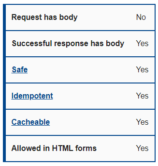
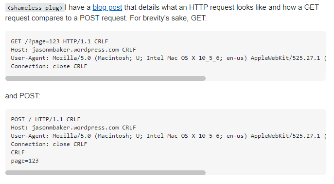
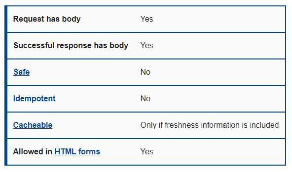
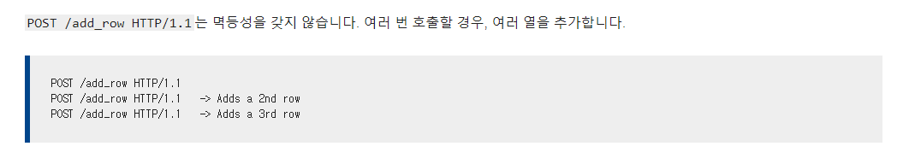
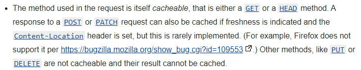
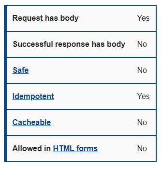
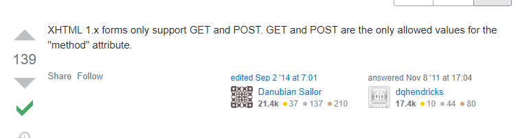
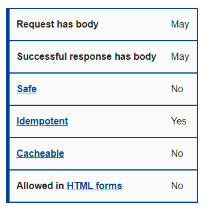
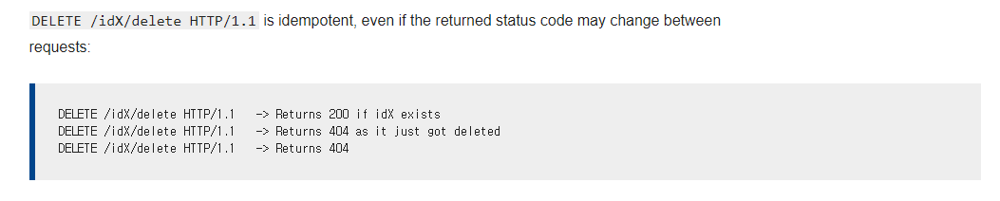
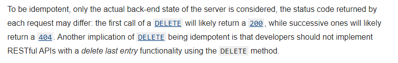

# HTTP Request Methods

## GET

**공식문서 표**



### Request has **NO** body

요청할 때를 생각해보면 쉽다. URL 요청과 헤더만 보내며 URL로 쉽게 접근할 수 있다.

:::note

그런데 이상한 짓을 해본 사람이 있다. [**이 글**](https://libsora.so/posts/http-get-request-with-body-and-http-library/)을 보면 GET에 Body를 붙여 요청을 해보는 실험을 볼 수 있는데, 결론은 라이브러리마다 Body를 붙일 수 있는지에 대한 여부가 다르다. 그래도 GET의 기본 스펙을 생각해서 Body를 쓰진 말자.
:::

<br />

### Successful response has body

GET은 데이터를 가져오기 위한 Method이다. 그러므로 데이터를 가져오기 위한 응답에는 Body가 있어야 한다.

<br />

### Safe

서버가 얼마나 안전하냐는 뜻이다. GET으로는 데이터를 가져오기만 하기 때문에 서버의 데이터를 가져올 뿐 서버의 데이터를 변경하지 않는다. 하지만 서버 설계가 잘 못 되어있는 경우는 큰 참사가 일어날 수도 있다. (대표적인 예제: 구글 엑셀레이터 사건)

:::note
참고로 서버가 안전하다는 것을 착각하는 경우가 있다. **서버가 변하지 않는다는 뜻이지, 보안에 대해 안전하다는 뜻이 아니다.** 또한, BODY에 담아도 네트워크 지날 때는 플레인 텍스트로 지나간다. 밑의 요청 형식에 대한 예제를 보면 확실히 알 수 있다.



GET은 url로 page=123을 보내지만 POST는 Body에 page=123을 보낸다. 그냥 그 차이일 뿐이다. 암호화는 전혀되지 않는다. 그러므로 SSL 설정이나 다른 암호화 방식을 추가해야 안전하다.

[**스택 오버플로우**](https://stackoverflow.com/questions/1008668/how-secure-is-a-http-post) 참고
:::

<br />

### Idempotent

멱등성이라고 불린다. 여러 번 요청을 했을 때 똑같은 응답을 한다면 멱등성을 띄게 된다. 즉, 우리가 GET을 요청할 때 DB에 있는 데이터를 요청한다. 하지만 똑같은 주소로 똑같이 요청했다면 똑같은 응답을 가져올 것이다. 그럼 여기서 의문을 가질 수 있다.

**"내가 요청한 후에 데이터가 추가되었으면 다른 데이터가 가져와 지는게 아닌가요?"**

어떤 테이블의 전체 데이터를 가져오는 GET API인데 다른 POST 요청으로 데이터가 추가되었다. 다음 GET 요청에는 데이터가 당연히 추가되겠지만 이 상태에서 여러 번 요청을 보내도 같은 응답이 와진다. 즉, GET은 서버의 데이터가 추가된 후 상태에서 추가된 데이터에 대해서 같은 응답을 한다. 추가되어서 응답이 다르다고 멱등성을 가지지 않는다고 말할 수 없다. 현재 상태에서 같은 응답이 나온다면 멱등성을 가지는 것이다.

즉, 멱등성이란 **서버에 여러번 요청을 보냈을 때, 여러 번의 요청이 서버상태를 같은 상태로 변화시키거나 변화시키지 않고 응답이 같은 것**을 말한다.

<br />

### Cacheable

GET Method는 받은 데이터를 캐시한다. 왜냐하면 서버에서 건드리는게 없고 서버의 데이터가 변하지 않았다면 굳이 서버에서 모든 데이터를 받아올 필요가 없기 때문이다. 캐시에 대한 내용은 서버 측과 클라이언트 측에서 설정할 수 있는데 'cache-control'이라는 변수를 통해 지정할 수 있다.

#### 클라이언트에서 쓰는 cache-control

```
Cache-Control: max-age=<seconds>
Cache-Control: max-stale[=<seconds>]
Cache-Control: min-fresh=<seconds>
Cache-Control: no-cache
Cache-Control: no-store
Cache-Control: no-transform
Cache-Control: only-if-cached
```

#### 서버에서 쓰는 cache-control

```
Cache-Control: max-age=<seconds>
Cache-Control: s-maxage=<seconds>
Cache-Control: private
Cache-Control: public
Cache-Control: no-cache
Cache-Control: no-store
Cache-Control: no-transform
Cache-Control: must-revalidate
Cache-Control: proxy-revalidate
```

:::info
'cache-control'에는 확장 명령어가 더 있다. [**공식문서**](https://developer.mozilla.org/en-US/docs/Web/HTTP/Headers/Cache-Control) 참고
:::

<br />

### Allowed in HTML forms

우리가 HMTL에서 폼으로 데이터를 보낼때 밑과 같이 보낼 수 있다.

```html
<form action="/action_page.php" method="get">
  <label for="fname">First name:</label>
  <input type="text" id="fname" name="fname" /><br /><br />
  <label for="lname">Last name:</label>
  <input type="text" id="lname" name="lname" /><br /><br />
  <input type="submit" value="Submit" />
</form>
```

<br />

## POST

**공식문서 표**



### Request has body

Body는 데이터 크기 제한이 유연해지고 암호화할 수 있게 만든다. POST의 대부분 목적이 인증과 생성이므로 Body는 필수이다. 하지만 Body가 암호화할 수 있다고 했지, 암호화가 되어 전달된다는 것은 아니다. 따라서 따로 보안을 강화하기 위해 SSL을 사용한다.

:::caution
데이터 크기 제한이 없다고 하더라도 Web Server 상에서 제한을 걸 수 있다. 따라서 그 제한을 맞춰야 한다. 예를 들어, 우리가 머신러닝을 하며 나온 데이터를 DB로 저장한다고 하자. 그 데이터가 1M가 넘는데 제한이 1M이다. 그러면 한 번에 다 못보낸다. 따라서 Nginx 같은 경우 제한을 풀 수 있는데 밑과 명령어를 작성할 수 있다.

```nginx
client_max_body_size 50M
```

:::

<br />

### Successful response has body

Response에도 Body가 존재한다. 데이터 생성에는 굳이 필요없을지 몰라도 인증이나 다른 방식에 쓰이는 API에서 응답 본문은 필요한 존재이다.

**로그인 [FastAPI 튜토리얼](https://fastapi.tiangolo.com/tutorial/security/oauth2-jwt/?h=jwt) 코드**

```python
@app.post("/token", response_model=Token)
async def login_for_access_token(form_data: OAuth2PasswordRequestForm = Depends()):
    user = authenticate_user(fake_users_db, form_data.username, form_data.password)
    if not user:
        raise HTTPException(
            status_code=status.HTTP_401_UNAUTHORIZED,
            detail="Incorrect username or password",
            headers={"WWW-Authenticate": "Bearer"},
        )
    access_token_expires = timedelta(minutes=ACCESS_TOKEN_EXPIRE_MINUTES)
    access_token = create_access_token(
        data={"sub": user.username}, expires_delta=access_token_expires
    )
    return {"access_token": access_token, "token_type": "bearer"}
```

<br />

### **NOT** safe

POST 요청 대부분의 목적이 서버에 데이터를 추가하는 것이다. 이는 서버에 새로운 데이터가 생성되어서 서버의 데이터가 바뀐다는 것을 의미한다. 따라서 서버는 안전하지 않다.

<br />

### **NO** Idempotent

GET에서 설명했듯이 멱등성은 멱등성이란 **서버에 여러번 요청을 보냈을 때, 여러 번의 요청이 서버상태를 같은 상태로 변화시키거나 변화시키지 않고 응답이 같은 것**을 말한다. POST는 데이터를 생성시키면서, 응답도 데이터 생성마다 다르다. 따라서 멱등성을 찾아 볼 수가 없다.



<br />

### **Optional** cacheable

서버에 영향을 주는 거면 캐시되면 안될테고, 안 준다면 해도 되긴 할 듯하다. POST는 용도가 다양하긴 하니까.

어쨋든 공식문서에는 "Only if freshness information is included" 라고 한다. 진짜 새로운 정보가 응답에 있을 때만이라고 하는데, 공식문서를 보니 Content-Location을 set 해주면 따로 또 캐시가 된다고 한다.



<br />

### Allowed in HTML forms

HTML에서 지원을 해주며 밑과 같이 사용할 수 있다.

```html
<form action="/action_page.php" method="post">
  <label for="fname">First name:</label>
  <input type="text" id="fname" name="fname" /><br /><br />
  <label for="lname">Last name:</label>
  <input type="text" id="lname" name="lname" /><br /><br />
  <input type="submit" value="Submit" />
</form>
```

<br />

## PUT

**공식문서 표**



### Request has body

이건 포스트와 비슷한 개념으로 생각하면 된다. POST로 보내던 것을 일부만 PUT으로 보내는 것이다. Update 개념인데 PATCH와는 다르게 모든 데이터를 삭제 후, 다시 생성하는 메소드이다.

### Successful response has **NO** body

일부를 변경한다는 것은 이미 데이터를 알고 있었다는 뜻이고, 새로 생성하는게 아니라 수정이다. 그러므로 응답할 것은 코드로 성공과 실패를 알려주면 된다. 즉, Body가 필요없다.

### **NOT** safe

앞에서 말한대로 안전하다는 것은 서버의 데이터가 변하지 않아야 한다. 서버 데이터를 수정하므로 안전하지 않다.

### Idempotent

PUT으로 Body를 넣어서 똑같은 요청을 해보자. 그러면 데이터 수정이 같은 데이터에만 반복되므로 서버상태가 같은 상태로 변경되고 응답이 같다. 그러므로 PUT은 POST와 다르게 멱등성을 가지게 된다.

### **NOT** cacheable

응답도 없고, 데이터를 수정해야 하는데 캐시를 하려는 것은 말이 안된다.

### **NOT** allowed in HTML forms

공식문서 상 안해준다고 명시되어 있으며, 밑의 스택 오버플로우에서도 말해준다.



<br />

## DELETE

**공식문서 표**



### Successful **Optional** response/request has body

이건 묶어서 설명해야 한다. 원래는 DELETE는 둘 다 지원하지 않는다. 하지만 지원해야 할 경우가 몇 가지 있는데, pk 값이 너무 큰 경우나 url에 넣을만한 요소가 아니거나. 이런 경우 get처럼 못 보낸다. 그래서 이렇게 body가 생기는 것이고, 이 값을 쓰려면 POST나 PUT과 다른 방식으로 보내거나, 프레임워크마다 요구하는 것이 좀 다르다. 제일 자주 쓰는 방식은 헤더에 넣어서 보내는 거나 원래 부터 body를 지원하는 형식 두 가진 것 같다. 프레임워크 별로 다르니까 delete쓸 때, body가 꼭 필요하다면, 각 프레임워크에 맞게 검색해서 찾아 쓰면 될 듯하다.

### **NOT** safe

앞에서 말한대로 안전하다는 것은 서버의 데이터가 변하지 않아야 한다. 서버 데이터를 삭제하므로 안전하지 않다.

### Idempotent

요고도 애매할 수 있다. 하지만 PUT과 같은 개념이다. DELETE로 똑같은 요청을 해보자. 그러면 데이터 삭제가 같은 데이터에만 반복되므로 삭제가 되었으면 삭제, 삭제가 이미 되었으면 이미 되었다고 응답한다. 이렇게 한 데이터에만 요청하니 멱등성을 가진다.



:::caution


위의 내용을 보면 DELETE 메소드로 데이터의 마지막 엔트리를 삭제하는 API를 만들지 마라고 되어있다. 이럴 경우 멱등성을 위반하기 때문이다.
:::

### **NOT** Cacheable

PUT과 마찬가지로 응답이 있다하더라도 삭제 기능을 해야하기 때문에 캐시할 이유가 없다.

### **NOT** allowed in HTML forms

PUT과 마찬가지로 공식문서 상 안해준다고 명시되어 있으며, 밑의 스택 오버플로우에서도 말해준다.


<br />
