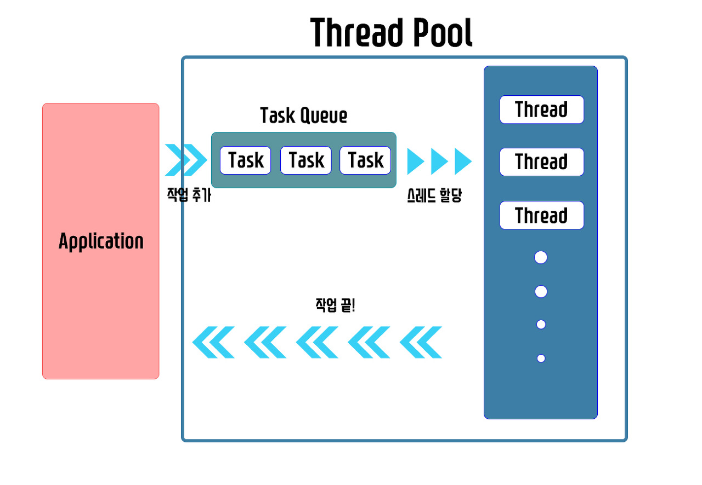

# Thread Pool

스레드 풀이란 어플리케이션에서 코드 실행을 하여 작업태스크 큐에 전달하여 순서대로 스레드에 작업시키게 만드는 것을 말한다. 결과 값은 어플리케이션으로 보내진다.

콜백방식과 블로킹 방식이 있으며, 값을 전달하는 callable과 작업만 하는 runnable이 있다.

초기 스레드, 코어 스레드, 최대 스레드가 있는데, 스레드 풀이 생성 될 때 생기는 스레드의 갯수를 초기 스레드라고 하고 최소 단위로 유지되는 스레드의 갯수를 코어 스레드, 최대 스레드는 스레드가 만들어질 수 있는 최대 스레드이다.

즉, 스레드의 생성은 최대 스레드 갯수를 초과하지 않는다.

밑의 그림을 보면 이해하기 쉽다.

 

## 요약

* 스레드 풀 동작 방식
  * 코드 실행 -> 작업 태스크 큐 -> 스레드 할당 -> 작업 끝
* 작업 순서 결정
  * 콜백 방식 - 진행중인 어플리케이션 모든 작업이 끝난 후 스레드 결과 값을 처리하는 로직을 실행함.
  * 블로킹 방식 - 어플리케이션 작업을 중단하고 스레드 결과 값을 처리하는 로직을 먼저 실행함.
* 작업 방식
  * callable - 어플리케이션에 값을 전달
  * runnable - 어플리케이션에 값을 전달하지 않음
* 스레드 풀 설정
  * 초기 스레드 수 - 스레드 풀에 설정된 스레드 풀 초기 스레드 수
  * 코어 스레드 수 - 스레드 풀에 남아있어야 하는 최소 스레드 수
  * 최대 스레드 수 - 스레드 풀에 있을 수 있는 최대 스레드 수

 

> 참고하면 좋은 글: https://m.blog.naver.com/mals93/220743747346

 
