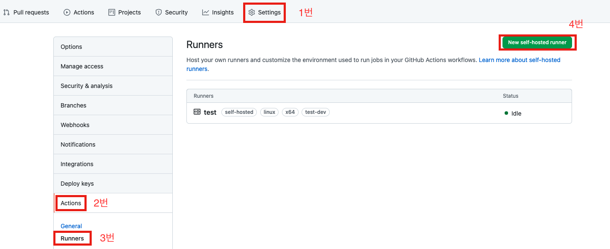
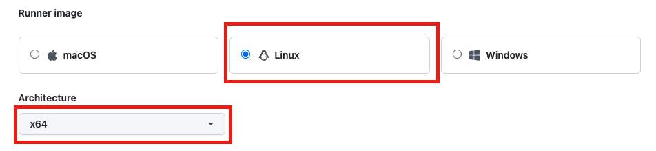
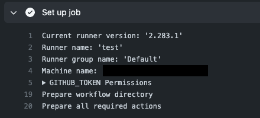
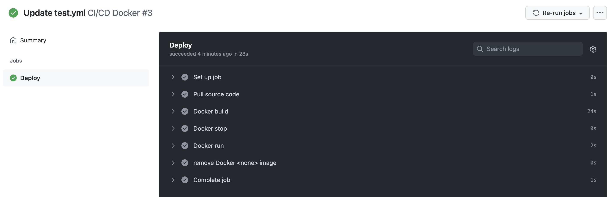
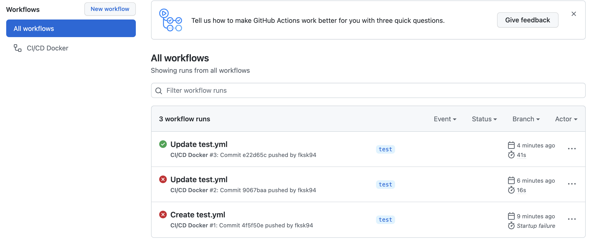
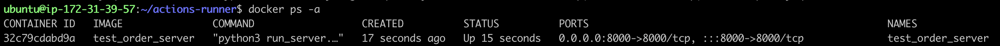

# GitHub Actions

## 목표

GitHub Actions을 통한 컨테이너 CI/CD 환경 구축

## GitHub - EC2 Connection

### 기본 구조

1. GitHub에서 쉘 스크립트와 파일들을 EC2에 다운받고 토큰으로 인증한다.
2. EC2 상에서 리스닝받는 쉘 스크립트를 실행시킨다.
3. GitHub에서 요청과 스크립트를 보낸다.

### Runner Settings

Runner란 EC2같은 서버를 뜻한다. 어떤 서버에서 Actions의 스크립트를 쓸건지 지정하기 위해 설정한다.

레파지토리에서 Settings -> Actions -> Runners -> New self-hosted runner 를 선택한다.




Runner image는 Linux, Architecture는 x64를 선택 후, 밑의 Download와 Configure의 명령어를 차례로 EC2에 입력한다.

(운영체제와 아키텍쳐는 상황에 맞게 선택한다.)



Configure의 첫 번째 명령어에서 입력할 것은 4가지가 있다.

1. runner 그룹으로 아직은 신경쓸 필요는 없어보인다. (그냥 enter를 치면 된다.)
2. runner 네임으로 해당 runner가 어떤 러너인지 명시해준다.
3. runner의 라벨으로 이 러너를 지정할 때 쓰는 요소이다. 라벨은 alias같은 느낌이라고 생각하면 된다. 쿠버네티스에서도 쓰이니 잘 알아두자.
4. 로컬의 work 폴더 네임이다. 그냥 enter 치면 _work 폴더로 지정되니 enter로 넘어가면 된다.

Configure의 두 번째 명령어인 `./run.sh` 는 `nohup ./run.sh &`로 백그라운드에서 실행시킨다.

실행되었다면 확실히 연결이 되었는지를 확인하기 위한 더미스크립트를 작성한다. 확인을 위해 date를 바꿔본다.

```yaml
name: GitHub Actions CI/CD

on:
  push:
    branches: [ master, develop ]

jobs:
  deploy:
    name: Deploy
    # 중요한 점: test-dev는 앞서 설정한 runner의 runner의 라벨이다.
    runs-on: [ test-dev ]
    steps:
      - name: test
        run: |
          sudo ln -sf /usr/share/zoneinfo/Egypt /etc/localtime
```


이 스크립트는 레파지토리의 `.github/workflows` 폴더에 `yml` 파일로 작성한다. 파일의 이름은 해당 작업에 맞게 작성하면 된다. 위의 스크립트는 `push` 트리거로만 가능하다. 푸시 트리거가 발동되면 해당 스크립트가 실행된다. 이후, ec2 상에서 `date` 를 입력했을 때, 이집트의 시간이 나오면 성공이다.

레파지토리의 Actions 탭에서 워크플로우들을 확인할 수 있으며, 어떤 상태인지 로그를 확인할 수 있다.




이후, ec2 상에서 `date` 를 입력하면 이집트의 시간이 나온다.

다시 서울 시간으로 바꾸려면 `sudo ln -sf /usr/share/zoneinfo/Asia/Seoul /etc/localtime` 을 입력하면 된다.


## Workflows Script

GitHub Actions를 사용하기 위해선 스크립트를 작성할 줄 알아야 한다. 스크립트를 기준으로 알아본다.

### 예제 스크립트

예제 스크립트)

```yaml
name: CI/CD Docker

on:
  push:
    branches: [ master ]
env:
  PORT: 8000
  IMAGE: server
  CONTAINER: server
  REPOSITORY_OWNER: fksk94
  REPOSITORY: example
  USER: fksk94

jobs:
  deploy:
    name: Deploy
    runs-on: [ self-hosted, test-dev ]
    steps:
      - name: Check out source code
        uses: actions/checkout@v2
      - name: Pull source code
        run: |
          cd /home/ubuntu/${{ env.REPOSITORY }}
          git pull https://${{ env.USER }}:${{ secrets.USER_TOKEN }}@github.com/${{ env.REPOSITORY_OWNER }}/${{ env.REPOSITORY }}.git ${{ env.BRANCH }}
      - name: Docker build
        run: docker build -t ${{ env.IMAGE }} /home/ubuntu/${{ env.REPOSITORY }}
      - name: Docker stop
        run: |
          docker ps -f name=${{ env.CONTAINER }} -q | xargs --no-run-if-empty docker container stop
          docker container ls -a -f name=${{ env.CONTAINER }} -q | xargs -r docker container rm
      - name: Docker run
        run: docker run -d --name ${{ env.CONTAINER }} -p ${{ env.PORT }}:${{ env.PORT }} -v /etc/localtime:/etc/localtime:ro --restart always ${{ env.IMAGE }}
      - name: remove Docker <none> image
        run: if [ "$(docker images -f dangling=true -q)" != "" ]; then docker rmi $(docker images -f dangling=true -q); fi
```


스크립트 설명)

```yaml
# 워크 플로우 이름 설정
name: CI/CD Docker

# 어떤 트리거로 발동시킬 것인가
on:
  # 푸시 트리거 설정
  push:
    # 브랜치 설정
    branches: [ master ]
# 환경변수 설정
env:
  PORT: 8000
  IMAGE: server
  CONTAINER: server
  REPOSITORY_OWNER: fksk94
  REPOSITORY: example
  USER: fksk94

# 실제로 할 명령들 설정
jobs:
  # job의 분기
  deploy:
    # 해당 job의 이름
    name: Deploy
    # 어느 곳에서 실행을 할 건지 설정, self-hosted는 외부 runner, test-dev는 우리가 정한 runner의 라벨
    # 여기서 EC2환경과 연결한다고 보면 쉽다.
    runs-on: [ self-hosted, test-dev ]
    # 여러 단계 설정
    steps:
      # 소스코드 체크
      - name: Check out source code
        uses: actions/checkout@v2
      # EC2에 코드 풀 받음.
      - name: Pull source code
        run: |
          cd /home/ubuntu/${{ env.REPOSITORY }}
          git pull https://${{ env.USER }}:${{ secrets.USER_TOKEN }}@github.com/${{ env.REPOSITORY_OWNER }}/${{ env.REPOSITORY }}.git ${{ env.BRANCH }}
      # 도커 이미지 빌드
      - name: Docker build
        run: docker build -t ${{ env.IMAGE }} /home/ubuntu/${{ env.REPOSITORY }}
      # 현재 실행 중인 도커 컨테이너 스탑 및 비활성화 이미지 제거
      # 빌드 부터 하고 컨테이너를 제거하는 이유는 1초라도 더 컨테이너가 띄워져 있기 위함이다.
      - name: Docker stop
        run: |
          docker ps -f name=${{ env.CONTAINER }} -q | xargs --no-run-if-empty docker container stop
          docker container ls -a -f name=${{ env.CONTAINER }} -q | xargs -r docker container rm
      # 도커 컨테이너 새로 생성
      - name: Docker run
        run: docker run -d --name ${{ env.CONTAINER }} -p ${{ env.PORT }}:${{ env.PORT }} -v /etc/localtime:/etc/localtime:ro --restart always ${{ env.IMAGE }}
      # 예전 이미지 제거
      - name: remove Docker <none> image
        run: if [ "$(docker images -f dangling=true -q)" != "" ]; then docker rmi $(docker images -f dangling=true -q); fi
```


## Final Check

### 실제 동작 확인

* Actions



* 세부 workflow



* 도커 컨테이너 확인




GitHub Actions CI/CD 실제 동작 확인 완료.

<br/>