# Jenkins with GitHub

## 준비 사항 및 참고 사항

* Linux 서버(AWS Ec2, GCP compute, Vultr compute 등)
* 프론트와 서버는 React.js와 Express.js(GraphQL)을 기준으로 작성
* DB는 생략 - DB 도커 설치 참고 URL
  * https://blog.taewan.link/docs/Database/mysql-docker-setting
  * https://blog.taewan.link/docs/Database/psql-docker-setting


## 설치 및 연결

준비 해놓은 Linux 서버에 접속한다. 접속방법은 다양하지만, 요즘은 window에서도 putty가 없어도 git bash같은 다른 shell 프로그램을 이용하면 ssh 접속이 가능해지니까 bash에서 이런 방식으로(`ssh -i {keyname}.pem ubuntu@{domain or Elastic IP}`,  `ssh root@{domain or Elastic IP}`) 접속하자. 각 서버 별로 접속하는 방법이 다르니까 서버 접속은 각 서버 제공사의 documentation을 참고하자. 또한, 각 서버별로 sudo를 써야할 때가 있고 아닐 때가 있으며, user에 그냥 권한을 부여해줘도 된다.

```bash
# 서버 처음 들어갔을때
sudo apt-get update
```

### 도커 설치

```bash
# 필수 패키지 설치
sudo apt-get install apt-transport-https ca-certificates curl gnupg-agent software-properties-common
# GPG Key 인증
curl -fsSL https://download.docker.com/linux/ubuntu/gpg | sudo apt-key add -
# docker repository 등록
sudo add-apt-repository "deb [arch=amd64] https://download.docker.com/linux/ubuntu $(lsb_release -cs) stable"
# 도커 설치
sudo apt-get update && sudo apt-get install docker-ce docker-ce-cli containerd.io
# 시스템 부팅시 도커 시작
sudo systemctl enable docker && service docker start
# 도커 확인
sudo service docker status
```

### 도커 컴포즈 설치

```bash
# 도커 컴포즈 설치
sudo curl -L https://github.com/docker/compose/releases/download/{version(ex. 1.29.1)}/docker-compose-`uname -s`-`uname -m` -o /usr/local/bin/docker-compose
# 위의 설치가 안될 경우 - 폴더 위치가 cloud server마다 다르기 때문에 변경할 필요가 있음.
sudo curl -L https://github.com/docker/compose/releases/download/{version(ex. 1.29.2)}/docker-compose-`uname -s`-`uname -m` -o /usr/bin/docker-compose
sudo chmod +x /usr/bin/docker-compose
```

### 젠킨스 설치

포트는 임의로 설정해주면 된다.

파일 이름: docker-compose.yml

```yaml
services: 
	jenkins: 
        image: 'jenkinsci/blueocean' 
        restart: unless-stopped 
        user: root 
        privileged: true 
        ports: 
         - '9090:8080' 
        volumes: 
         - '/home/ubuntu/docker/jenkins-data:/var/jenkins_home'
         - '/var/run/docker.sock:/var/run/docker.sock'
         - '$HOME:/home'
        container_name: 'jenkins'
```

### 젠킨스 실행

```bash
# 해당 디렉토리에서 도커 컴포즈 업!
sudo docker-compose up -d
# 실행시킨 도커 컨테이너에 접속
sudo docker exec -it jenkins bash
# 비밀번호 겟해야함. 젠킨스의 초기 비밀번호로 인터넷상에서 들어갈 수 있음.
cat /var/jenkins_home/secrets/initialAdminPassword
# 이 비밀번호로 http://{도메인}:9090 들어갈 수 있음.
```

### 젠킨스 연동

1. 웹(http://{도메인}:9090)으로 들어가서 권장 설치 선택
2. 아이디 비번 만들고, url에서 next!
3. 젠킨스로 들어와지면 Gihub 관련된 Plugin 설치(Jenkins 관리로 들어가면 플러그인관련 항목이 뜬다.)

  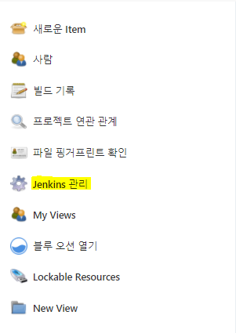

4. Git Plugin과 GitHub plugin, GitHub Integration Plugin을 설치한다.

  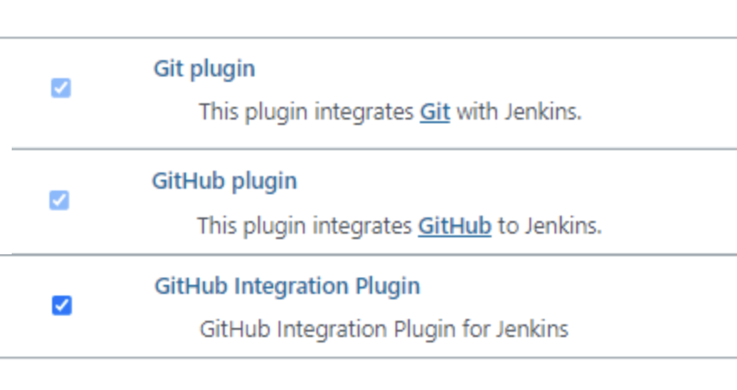

5. 설치 후, 젠킨스 홈으로 돌아와, 위의 젠킨스관리를 다시 들어가서 **시스템** 설정을 들어간다.
6. 들어가서 GitHub를 찾아서 연동시켜야 한다. 이 부분에서 깃과 연동되었는지 오른쪽 밑의 test connection 버튼에서 확인을 할 수 있다. 연동 시키는 것은 Credential이 있어야 하는데, 이 Credential Token은 깃 허브에서 얻을 수 있다.

  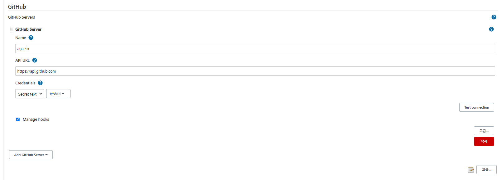

7. 깃 허브에서 프로필을 눌러 세팅으로 들어간다.

  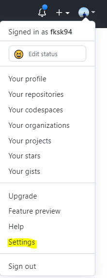

8. 세팅 메뉴에서 Developer settings로 들어간다.

  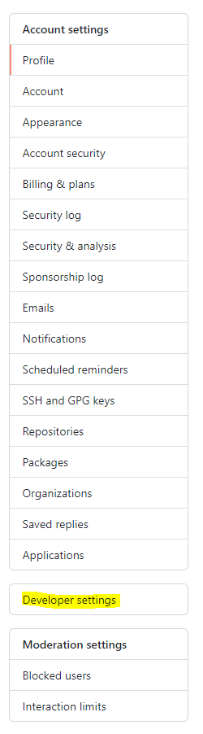

9. 깃에서 Personal access tokens로 들어가서 Generate new token을 누른다.

  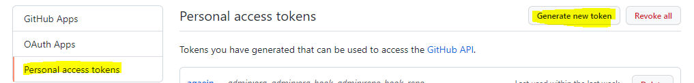

10. Note와 Expiration을 원하는대로 설정하고 밑의 Select scopes를 설정하는 것이 중요하다. repo와 admin:org, admin:repo_hook, admin:org_hook을 체크한다.

  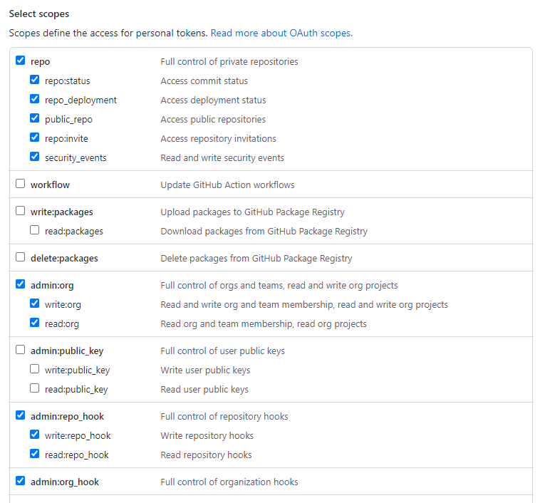

11.  만들면 토큰이 생성되는데 secret key 값이 생성된다. 해당 키 값을 저장해 놓자. 이 키값은 다시 확인할 수 없고, 잃어버리면 다시 생성해야한다. 계속 저장해 놓는 것은 위험하니까, 설정할 때만 잠시 저장해놓고 설정 후, 지워버리거나 안전한 곳에 보관한다.

12.  이제 발급 받은 키값을 젠킨스에 등록할 차례다. Credentials 부분에서 Add Jenkins를 누르고 인증방식을 Secret text로 선택하여 방금 받은 키값을 넣어 저장한다. Credential에서 해당 key를 선택하고 Test connection을 눌러본다.

  

  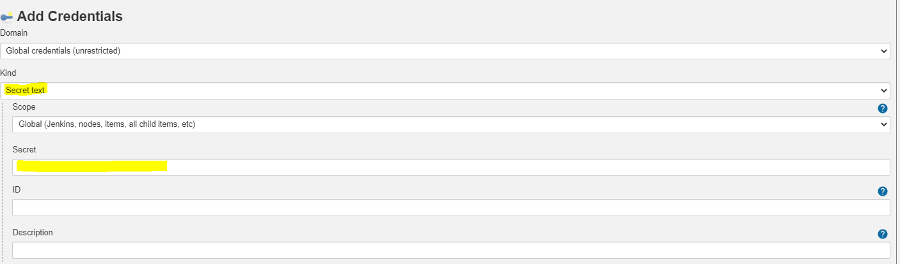

13.  시스템 환경설정은 끝났고 저장한다.

### 파이프라인 설정

1. 메인화면에서 새로운 아이템 선택하여 파이프라인을 설정한다. 설정할 때, General부터 차근차근 입력한다.

2. GitHub project에는 우리가 Git clone 받는 URL을 넣으면 된다.

3. Poll SCM에는 많은 트리거가 있고(Merge 포함), GitHub hook trigger for GITScm polling는 Push 트리거만 지원한다. Push만 필요하다면 GitHub hook trigger for GITScm polling만 선택해도 된다.

  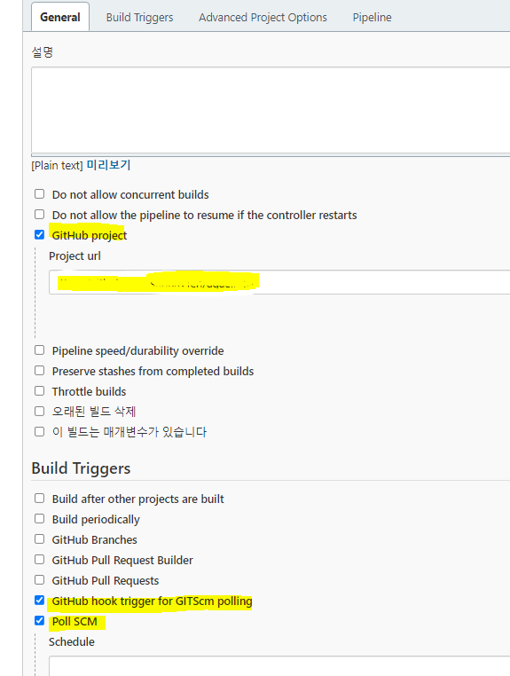

4. Jenkins pipeline 설정 입력
   * 훅을 받을 브랜치를 추가할 수 있다.
   * script path는 Jenkinsfile이 git상에 존재하는 폴더 위치이다.
  
    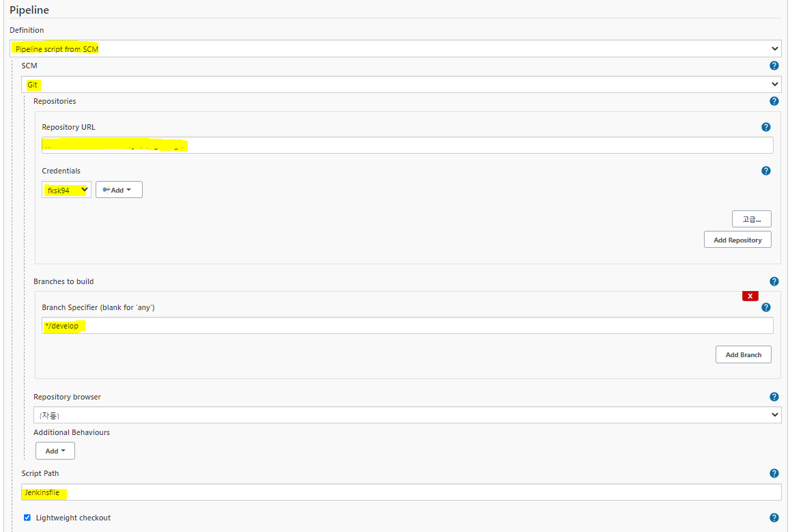

   * 여기서 Credentials는 ID는 원하는 것을 쓰고 Username에는 깃허브의 이름을 쓰고 private key는 서버에서 가져와서 입력해야한다.    

    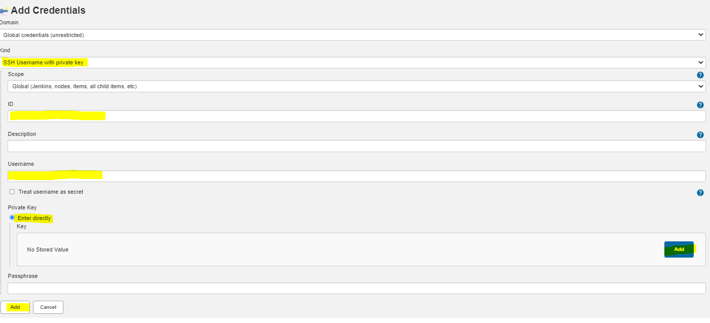
 
   * 서버에서 젠킨스 컨테이너로 들어가 키를 가져오는 방법

    ```bash
    sudo docker exec -it jenkins bash
    cat ~/.ssh/id_rsa # 이 주소는 각 서버, 젠킨스 버전마다 다르므로 찾아봐야 한다.
    ```
   * 설정 후, 저장.

5. 이렇게 저장하고 실행해보면 github에 hook이 생긴다. 안 생기면 밑과 같이 설정해준다.
   * github의 연결한 레파지토리를 살펴본다.
     * 레파지토리의 Settings - Webhooks에서 hook이 없다면 설정해준다.
     * 밑의 URL 부분의 지원진 곳은 서버의 IP나 도메인을 적는다. 뒤의 github-webhook은 똑같다.

       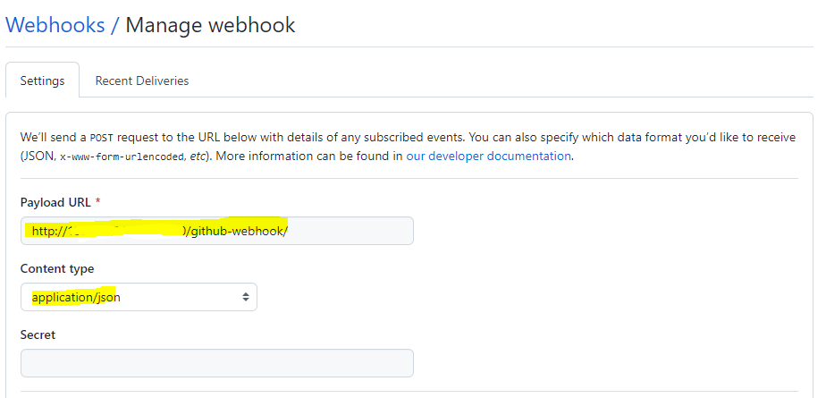

     * 옵션은 이렇게 3개 선택

    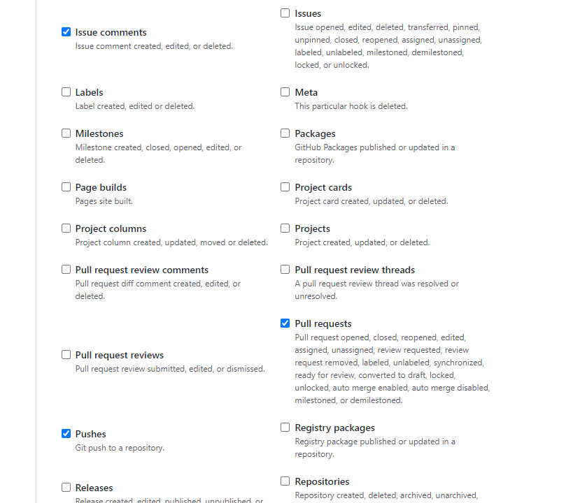

   * 저장

6. 이제 Deploy 키를 설정할 차례이다. 서버에서 젠킨스로 들어가서 키를 복사해온다.

  ```bash
  sudo docker exec -it jenkins bash
  cat ~/.ssh/id_rsa.pub # 이 주소는 각 서버, 젠킨스 버전마다 다르므로 찾아봐야 한다.
  # 읽은 키를 복사해 놓는다.
  ```

7. 레파지토리 세팅의 Deploy Key로 들어간다.

  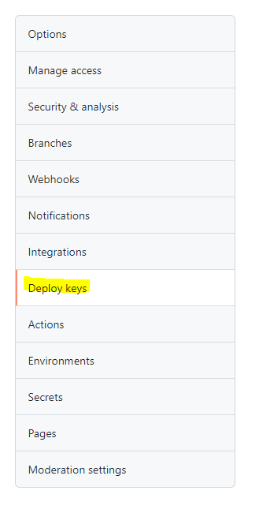

8. Tiltle은 원하는대로 설정하고 key에는 복사한 키를 붙여넣는다. write access는 푸시도 할 수있는 거라 체크 안하는 것을 추천한다.

  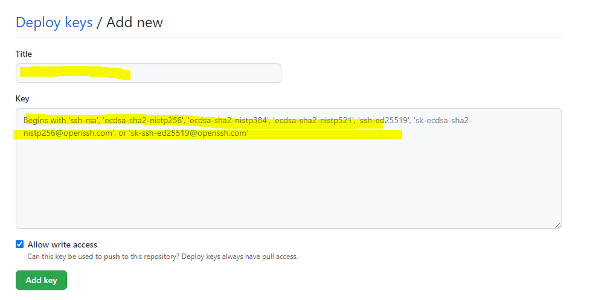

9. 젠킨스 연결 끝.


## 도커파일 작성

백엔드 도커파일: 백엔드의 최상위 폴더에 위치한다.

파일이름: dockerfile

```dockerfile
FROM node:14.17.5-alpine3.14
COPY . . 
RUN yarn install
RUN yarn build
EXPOSE 3005
CMD ["yarn", "start"]

```


프론트엔드 도커파일: 프론트엔드의 최상위 폴더에 위치한다.

파일이름: dockerfile

```dockerfile
FROM node:14.17.5-alpine3.14 as build-stage
WORKDIR /homepage
COPY . .
RUN yarn install
RUN yarn build

FROM nginx:stable-alpine as production-stage
RUN rm /etc/nginx/conf.d/default.conf
COPY ./homepage.conf /etc/nginx/conf.d/homepage.conf
COPY --from=build-stage ./homepage/build /usr/share/nginx/html/homepage
EXPOSE 3002
CMD ["nginx", "-g", "daemon off;"]

```


사실 nginx는 따로 설정해도 된다. 그리고 프론트엔드와 백엔드는 서로 다른 서버를 사용해도 된다.


## Https 설정

```bash
sudo apt-get install letsencrypt
# 인증서 발급
sudo letsencrypt certonly --standalone -d {도메인}
# 이메일 쓰고 Agree
# 뉴스레터 no
# 이제 인증서가 발급된다. 이 인증서를 잘보관하자
# 2가지 키가 발급되는데 이 두가지를 써야한다. 밑의 경로에 각각 하나씩 있다.
 ssl_certificate /etc/letsencrypt/live/{도메인}/fullchain.pem; 
 ssl_certificate_key /etc/letsencrypt/live/{도메인}/privkey.pem; 
```

```bash
# 복사해서 관리하려면 이런식으로 관리할 수 있다.
cp /etc/letsencrypt/live/{도메인}/fullchain.pem /home/ubuntu/sslkey/ 
cp /etc/letsencrypt/live/{도메인}/privkey.pem /home/ubuntu/sslkey/
```

> 여기 좀 더 자세히 나와있다. https://blog.taewan.link/docs/ETC/nginx


## nginx conf 작성

파일이름: homepage.conf

```conf
server {
        listen 80 default_server;
        listen [::]:80 default_server;

        server_name {도메인};

        return 301 https://$server_name$request_uri;
}

server {
        listen 443 ssl;
        listen [::]:443 ssl;

        root /home/ubuntu/agaein/agaein_web/build;
        # Add index.php to the list if you are using PHP
        index index.html index.htm index.nginx-debian.html;

        server_name {도메인};
        client_max_body_size 50M;
        
        ssl_certificate /var/jenkins_home/workspace/agaein/sslkey/fullchain.pem;
        ssl_certificate_key /var/jenkins_home/workspace/agaein/sslkey/privkey.pem;

        location / {
                # First attempt to serve request as file, then
                # as directory, then fall back to displaying a 404.
                alias /usr/share/nginx/html/homepage/;
                try_files $uri $uri/ /index.html;
        }

        location /graphql {
                proxy_pass http://server:3005;
                proxy_http_version 1.1;
                proxy_set_header Connection "";

                proxy_set_header Host $host;
                proxy_set_header X-Real-IP $remote_addr;
                proxy_set_header X-Forwarded-For $proxy_add_x_forwarded_for;
                proxy_set_header X-Forwarded-Proto $scheme;
                proxy_set_header X-Forwarded-Host $host;
                proxy_set_header X-Forwarded-Port $server_port;
        }
}

```


## 젠킨스 파일 작성

젠킨스 파일은 깃 폴더에 최상위 폴더에 위치한다.

파일이름: Jenkinsfile

```Jenkinsfile
pipeline {
	agent none
	options { skipDefaultCheckout(false) }
	stages {
		stage('git pull') {
			agent any
			steps {
				checkout scm
			}
		}
		stage('Docker build') {
			agent any
			steps {
				sh 'docker build -t web:latest /var/jenkins_home/workspace/agaein/agaein_web'
				sh 'docker build -t server:latest /var/jenkins_home/workspace/agaein/agaein_server'
			}
		}
		stage('Docker run') {
			agent any
			steps {
				sh 'docker ps -f name=web -q \
        | xargs --no-run-if-empty docker container stop'
				sh 'docker ps -f name=server -q \
				| xargs --no-run-if-empty docker container stop'

				sh 'docker container ls -a -f name=web -q \
        | xargs -r docker container rm'
				sh 'docker container ls -a -f name=server -q \
        | xargs -r docker container rm'

				sh 'docker images -f dangling=true && \
				docker rmi $(docker images -f dangling=true -q)'

				sh 'docker run -d --name web \
				-p 80:80 \
				-p 443:443 \
				-v /home/ubuntu/sslkey/:/var/jenkins_home/workspace/agaein/sslkey/ \
				-v /etc/localtime:/etc/localtime:ro \
				--network agaeinnet \
				web:latest'
				sh 'docker run -d --name server \
				-v /etc/localtime:/etc/localtime:ro \
				--network agaeinnet server:latest'
			}
		}
	}
}
```


설정도 끝났다. 모두 설정한 것을 우리가 설정한 깃 브랜치에 올려보자. 그러면 알아서 CICD가 일어난다.


## 추가 설명

자, 이 코드를 따라하다 보면 https가 어떻게 설정되나 생각할 수 있다. 그냥 쓰실 분은 상관없지만, 이해하고 싶은 사람을 위해 설명해 본다. 일단 sslkey 폴더를 만든 것부터 시작이다. 그 폴더를 Jenkinsfile에서 볼륨 옵션으로 바인드-마운트를 해준다. 그니까 Jenkins로 CICD 작업이 되면서 nginx 컨테이너가 sslkey를 확인할 수 있게 되는것이다. 이를 이해하기 위해서는 도커볼륨의 선행지식이 필수이며 볼륨이 아니더라도 바인드-마운트정도는 이해하면 sslkey가 niginx에 어떻게 전달되는지 이해할 수 있다.

<br/>
