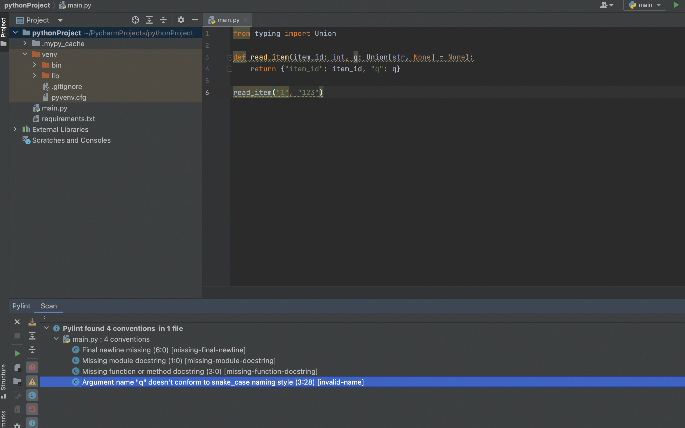
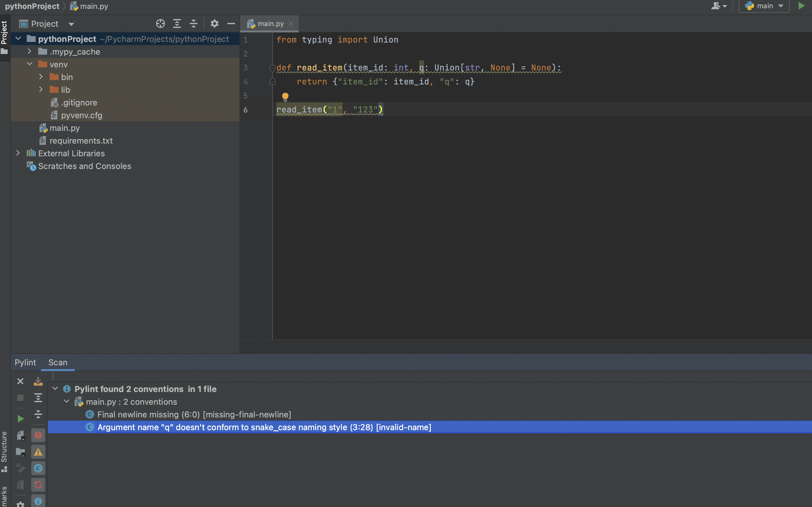

# Ch.01 코드 포매팅과 도구

## Annotation & Docstring

docstring과 annotation은 서로 보완적인 관계이다. 그래서 둘 중 어느 것을 쓰냐가 아니라 상황에 따라 둘 다 사용할 수도 있고, 아닐 수도 있는 것이다. 간단한 스크립트를 사용하거나 프로토타입을 만드는 코드라면 코드 문서화는 필요가 없지만, 계속 유지되어야하는 서비스 코드를 만드는 것이라면 적재적소에 annotation과 docstring을 써주어야 한다.

그리고 annotation이라고 해서 Java에서 쓰는 annotation과 헷갈릴 수도 있는데, 타입 annotation은 타입 힌트와 같다.

<br/>

_**annotation code**_

```python
def test(a: int, b: float) -> int:
    return int(a - b)
```


_**docstring code**_

```python
def test(a, b):
    """
    int와 float 빼기 연산
    - a: int
    - b: float
    - return: int
    """
    return int(a - b)
```


_**annotation & docstring code**_

```python
def test(a: int, b: float) -> int:
    """
    int와 float 빼기 연산
    - a: int
    - b: float
    - return: int
    """
    return int(a - b)
```

<br/>

## 코드 검사

### 데이터 타입 검사

mypy 라이브러리를 이용해서 의심되는 타입검사를 할 수 있다. 이는 annotation 기반으로 진행되기 때문에 타입 힌트 사용은 필수이다.

<br/>

_**mypy error 예제**_

```python
from typing import Union

def read_item(item_id: int, q: Union[str, None] = None):
    return {"item_id": item_id, "q": q}

read_item("1", "123")
```

```bash
pip install mypy
mypy ./{file-name}.py

-------- 응답 -------

main.py:6: error: Argument 1 to "read_item" has incompatible type "str"; expected "int"  [arg-type]
Found 1 error in 1 file (checked 1 source file)
```

<br/>

### 일반 코드 검사

pylint 를 일반적으로 쓴다. 해당 린팅 라이브러리로 코드를 검사하면 여러 코드 스멜들이 뜨는데, 이를 고치면 된다. 

```
pip install pylint
```


IDE 설치 방법은 pycharm을 기준으로 플러그인 세팅에서 pylint를 깔고 상단에서 view -> tool windows -> pylint 를 선택하고 하단의 tool windows에 뜬 pylint view에서 초록색 실행버튼을 누르면 된다. 그러면 밑과 같이 코드 스멜들이 나오고 해당 부분들을 확인하고 고칠 수 있다.





하지만 필요없는데도 잡힌 코드 스멜들이 있을텐데, 이것들은 생략할 수 있는 명령어가 있다. Preference -> pylint에서 argument 로 생략하고 싶은 코드를 설정하는 것이다. 생략하고 싶은 코드는 `https://github.com/janjur/readable-pylint-messages` 사이트를 참고하여 입력하면 된다. 또한, PEP-8 규정을 위한 룰 커스텀도 argument로 추가 가능하다.

<br/>

_**Argument 예제**_

```
--disable=C0111 --max-line-length=79
```


이렇게 설정 후, pylint를 실행시키면 밑과 같이 docstring의 코드 스멜이 사라진 것을 확인할 수 있다.




<br/>

### 자동 포매팅

다른 것도 있지만, 제일 유명한 Black으로 자동 포매팅을 해보았다.

```
pip install black
black ./main.py
```

위와 같이 명령어로 쓸 수 있지만 더 편한 방법은 IDE에 플러그인으로 등록하는 것이다.

BlackConnect 라는 플러그인을 깔고, `pip install black[d]`를 해준다음 `blackd` 라고 데몬을 실행시켜준다. 그 후 `alt` + `shift` + `b`를 누르면 알아서 블랙이 포맷팅 해준다. IDE 자체에 저장 시, 포맷팅해주는 방법도 있는데, 개인적으로 이 방법을 더 좋아한다.

<br/>
