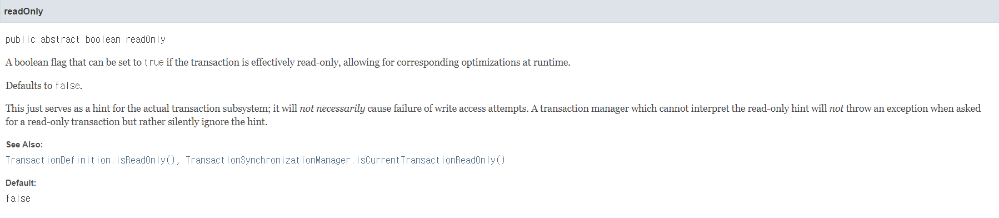

# Transactional ReadOnly

## 사전 지식
---

### 스냅샷(SnapShot)

먼저 SnapShot(이하 스냅샷)대해 알고 가야 readOnly에 대해 이해할 수 있다. 

DB는 우리가 조회, 변경, 수정, 삭제(이하 CRUD)를 할 때, 스냅샷을 만든다. 이 스냅샷는 우리가 명령했을 때, 해당 시기의 데이터이다. 그리고 만든 스냅샷에서 CRUD를 진행한 후, 스냅샷을 커밋하면 데이터베이스는 해당 데이터들을 추가 및 수정, 삭제 로직을 진행하게 된다.

### 고립성(Isolation)

하지만 스냅샷만 활용해서 DB가 변경이 진행된다면 동시성문제가 일어날 수 있다. 여기서 ACID 중 하나인 Isolation(이하 고립성)을 지키기 위한 Lock(이하 데이터 격리)이 일어난다. 스냅샷 커밋이 진행되면 해당 데이터들의 데이터 격리를 풀어 다른 트랜잭션의 접근을 허용시킨다.

### 격리 수준(Isolation Level)

여기에도 스냅샷의 격리 범위 설정이 있는데,

1. `READ UNCOMMITTED`
2. `READ COMMITTED`
3. `REPEATABLE READ`
4. `SERIALIZABLE`

이렇게 4가지가 존재한다.

#### READ UNCOMMITTED

스냅샷 격리를 시키지 않는다. 앞에서 다른 트랜잭션이 사용하고 있는 데이터가 변경되고 아직 커밋하지 않은 상태여도 또 다른 트랜잭션이 그 데이터를 조회해서 사용할 수 있다. 즉, Dirty Read가 일어나며 동시성에 매우 치명적인 문제이다.

#### READ COMMITTED

우리가 기본으로 쓰는 설정이다. 스냅샷을 격리시켜서 조회는 실제 커밋된 데이터들만 본다. 하지만 Non-Repeatable Read가 발생한다.

#### REPEATABLE READ

해당 레벨은 해당 트랜잭션 ID 보다 이전의 커밋된 데이터만 본다. 하지만 Phantom-Read가 발생한다.

#### SERIALIZABLE

쓰기 잠금을 걸어버린다. 아예 쓰고 있는 데이터에는 접근을 못 하도록 하는 것이다. 하지만 성능이 좋지 않다.


:::info
참고 링크 <br/>
https://windtrap.tistory.com/28 <br/>
https://nesoy.github.io/articles/2019-05/Database-Transaction-isolation <br/>
https://stackoverflow.com/questions/9880555/how-to-set-innodb-in-mysql-to-the-snapshot-isolation-level

참고로 mysql에서는 한 트랜잭션마다 스냅샷 격리 설정이 가능하고 전역으로 불가능 하다고 한다.
:::

<br/>

## ReadOnly 옵션
---



해당 파라미터를 true로 설정하게 되면 최적화를 하게 된다고 한다.(allowing for corresponding optimizations at runtime) 읽기 전용이라는 힌트를 트랜잭션에 전달한다고 되어 있으며, 각 트랜잭션(DB의 종류, 상태 등)에 따라서 다르고, 해당 트랜잭션(DB의 종류, 상태 등)가 지원하지 않는다면 **무시한다**라고 되어 있다.

> 공식문서: https://docs.spring.io/spring-framework/docs/current/javadoc-api/org/springframework/transaction/annotation/Transactional.html


### 옵션 사용 이유

- 해당 설정을 사용한 트랜잭션은 데이터(테이블, 칼럼)에 대하여 Lock을 적용할 필요가 없고 접근할 수 있는 데이터가 (스냅샷, 튜플 등) 변경되지 않기 때문에, 일관적인 데이터를 읽어오고 제공할 수 있다.
- 해당 속성의 경우 일반적으로 트랜잭션 ID를 부여하지 않아도 되기에 불필요한 ID 설정에 대한 오버헤드가 발생하지 않기 때문에 성능의 이점을 볼 수 있다.
   → 추가적으로 읽기-쓰기 트랜잭션을 위해 구성되는 별도 스냅샷의 총 수가 줄어든다.

> 출처: https://lob-dev.tistory.com/entry/DBMS-%EB%B3%84-Transaction-Read-Only%EC%97%90-%EB%8C%80%ED%95%9C-%EB%8F%99%EC%9E%91-%EB%B0%A9%EC%8B%9D-1

### Recap

위에서 말했듯이 readonly=true가 되면 DB에 이 트랜잭션이 조회 트랜잭션이라는 힌트를 전달한다. 그 힌트로 인해 데이터 변경이 없기 때문에 데이터 락을 설정할 필요가 없고, 읽기전용 트랜잭션을 위한 별도 스냅샷을 가져오며, (원래는 읽기-쓰기 트랜잭션이 기본인데 읽기전용 트랜잭션보다 무겁다.) 롤백을 위한 트랜잭션 ID를 만들지 않아도 된다.

### 실제 확인

실제로 코드를 만들어서 실행해봤다. 네트워크 비용을 최소화하기 위해 로컬 h2 디비를 사용하였고 Aop 시간체크방식을 이용하여 100건 저장 후, 모든 데이터 10000번 조회하며 확인해보았다. 주요 로직은 밑과 같으며 주석되어있는 readOnly 옵션을 바꿔가며 `make` 메소드를 한 번 실행 후, `doTransactionTimeTest` 를 10번씩 실행하였다.

```java
package com.example.demo.service;

import com.example.demo.aop.MeasureExecutionTime;
import com.example.demo.entity.TestData;
import com.example.demo.repository.TestDataRepository;
import org.springframework.transaction.annotation.Transactional;
import org.springframework.stereotype.Service;

@Service
public class IndexService {
    private final TestDataRepository testDataRepository;

    public IndexService(TestDataRepository testDataRepository) {
        this.testDataRepository = testDataRepository;
    }

    public void make() {
        for (int i = 0; i < 1000; i++) {
            testDataRepository.saveAndFlush(TestData.builder().data("test").build());
        }
    }

    @MeasureExecutionTime()
    // @Transactional(readOnly = false)
    @Transactional(readOnly = true)
    public void doTransactionTimeTest() {
        for (int i = 0; i < 10000; i++) {
            testDataRepository.findAll();
        }
    }
}
```

**결과**

환경: macOS, mem 16G, M1, java17, SpringBoot3.1.4, h2, jpa

|시도 횟수 | 1 | 2 | 3 | 4 | 5 | 6 | 7 | 8 | 9 | 10 |
|---|---|---|---|---|---|---|---|---|---|---|
|readOnly=true|3375|2024|1850|1909|1824|1798|1777|1786|1789|1800|
|readOnly=false|4455|4151|3457|3164|3124|3110|3138|3052|3080|3085|

<br/>

확실히 readOnly 옵션을 쓰는게 속도가 더 빨랐고 트랜잭션 안의 로직이 조회만 있다면 Transactional ReadOnly 옵션을 써주는 것이 성능향상에 도움될 듯하다.

<br/>

<div style={{"text-align": "right"}}> 최종 업데이트: 2023년 10월 13일 </div>